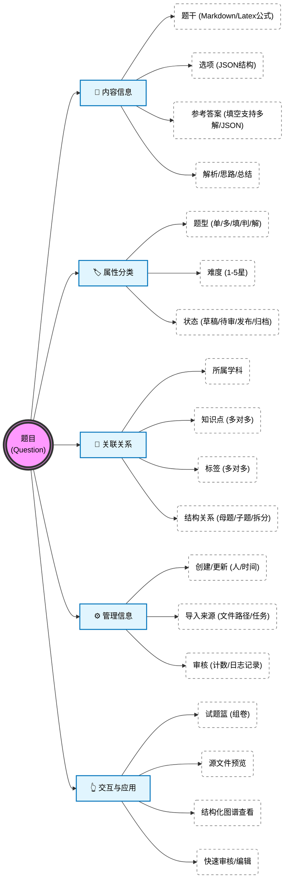
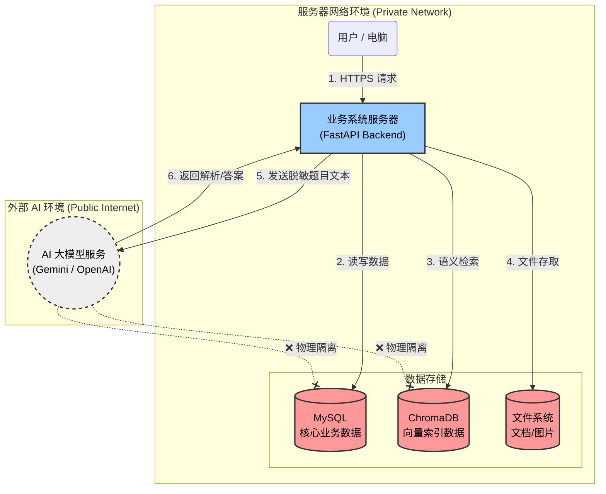
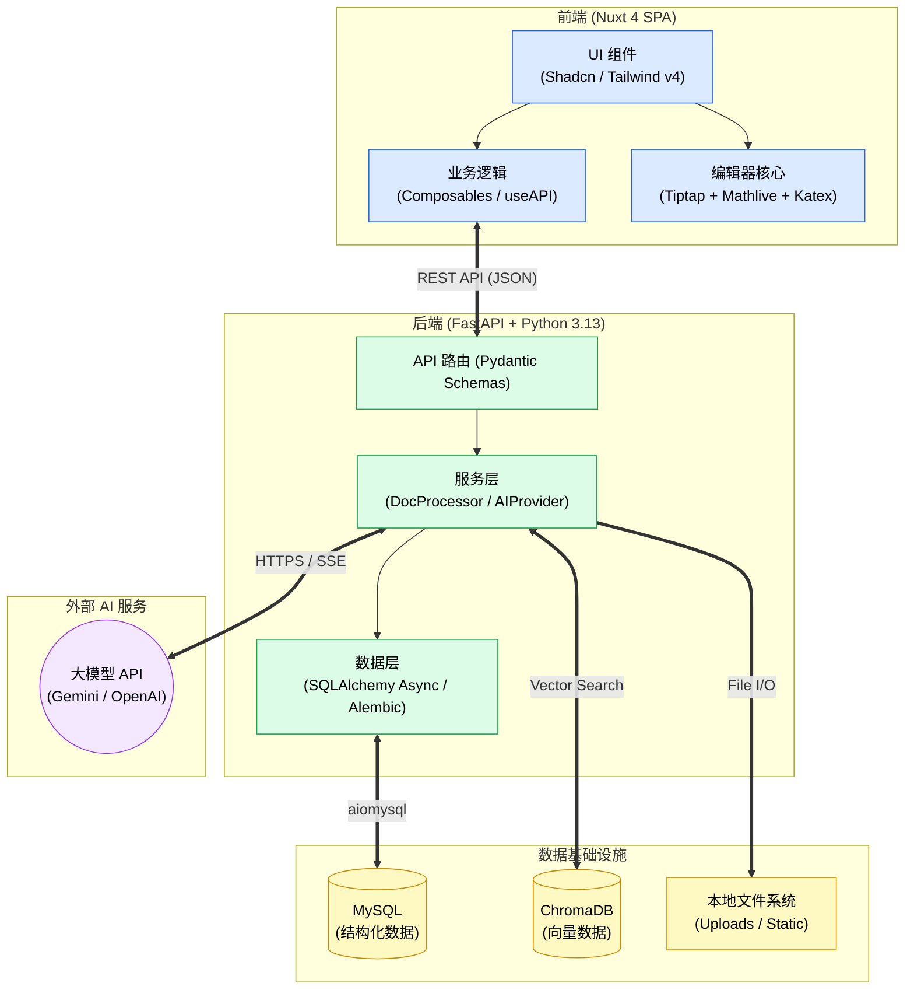
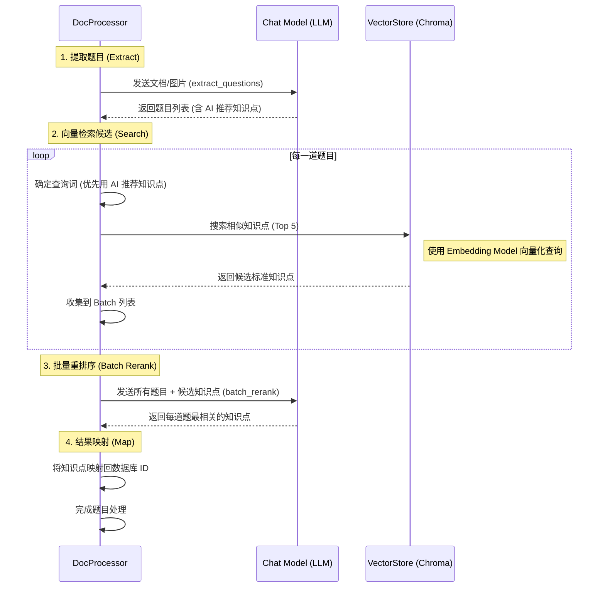

# Question Bank 题库系统

AI 原生的题库系统


## 核心特性

- **多格式智能导入**：Word / Markdown / 图片，AI 抽取结构化题目
- **多题型支持**：单选、多选、填空（支持多解）、判断、解答题；富文本 + LaTeX 公式
- **AI 多供应商**：Gemini、OpenAI 及所有 OpenAI 兼容 API（DeepSeek、通义、私有部署等），配置存于数据库、可热切换
- **知识点 RAG**：ChromaDB 向量检索 + 批量重排序，把 AI 推荐的知识点映射到标准体系
- **审核工作流**：草稿 → 待审 → 发布 → 归档，含审核日志、软删除、批量操作
- **组卷 / 试题篮**：跨条件筛选、临时收藏、导出

## 主要功能

| 模块 | 说明 |
|------|------|
| 智能导入 | 上传 Word / Markdown / 图片，AI 自动抽取结构化题目（三步流程：上传 → 审核 → 入库） |
| 题库管理 | 多条件筛选、批量操作、知识点/标签关联、母子题结构编辑、软删除 |
| 知识点体系 | 按学科组织的树形知识点，向量化入库，支持 RAG 自动匹配 |
| AI 对话 | 多模型聊天（支持图片），可选 Provider / Model，对话历史持久化 |
| 审核工作流 | 草稿 → 待审 → 发布 → 归档，审核日志完整记录 |
| 学科 & 标签 | 学科 CRUD、标签分类管理 |
| 用户 & 权限 | 用户管理、角色控制、登录统计 |
| 操作审计 | 全局活动日志，支持分页与筛选 |
| 系统设置 | AI Provider / Model 热配置、Prompt Template 管理（超管专属） |
| 文件预览 | DOCX / Markdown 源文件在线预览 |

## 快速体验 (Quick Start)

### Docker Compose

```bash
# 1. 克隆仓库
git clone https://github.com/gygy-open/question-bank.git question-bank && cd question-bank

# 2. 生成环境变量文件并修改
cp .env.example .env
# 编辑 .env，至少设置 SECRET_KEY 和 MYSQL_PASSWORD
# 生成随机 SECRET_KEY: openssl rand -hex 32

# 3. 启动全部服务（MySQL + ChromaDB + Backend + Worker + Frontend）
docker compose up -d --build

# 4. 首次启动后初始化数据
docker compose exec backend python scripts/initial_data.py

# 5. 创建超级管理员
docker compose exec backend python scripts/create_superuser.py
```

访问：
- 前端：http://localhost
- 后端 API 文档：http://localhost:8000/docs


## 架构与设计

### 题目全景视图 (Question Entity Overview)

此图展示了“题目”这一核心实体的全景视图，包含其组成要素、关联信息以及在前端交互中的应用能力。



### 安全架构图 (Security Architecture)

此图展示了系统中各组件的安全隔离设计，确保用户数据和隐私得到保护，同时利用外部 AI 服务进行题目处理。



### 技术架构图 (Technical Architecture)

此图展示了系统的整体技术栈与模块交互关系，供开发人员参考。



### 知识点提取与 RAG 流程 (Knowledge Extraction Workflow)

此图展示了优化的 RAG (Retrieval-Augmented Generation) 流程，特别是批量重排序机制。



## 本地开发

### 技术栈

| 层 | 技术 |
|---|---|
| 前端 | Nuxt 4 (SPA) · Vue 3.5 · TypeScript · Tailwind v4 · Shadcn UI · Tiptap · KaTeX · MathLive |
| 后端 | Python 3.13 · FastAPI · SQLAlchemy 2.0 (Async) · Alembic · Pydantic |
| 数据 | MySQL 8 · ChromaDB · 本地文件系统 |
| AI | Google Gemini · OpenAI 兼容 API |
| 部署 | Docker Compose · Nginx |

### 目录结构

```
question-bank/
├── backend/            # FastAPI 后端
│   ├── app/            # 业务代码 (api/ crud/ models/ schemas/ services/)
│   ├── alembic/        # 数据库迁移
│   └── scripts/        # 运维脚本
├── frontend/           # Nuxt 4 SPA 前端
│   └── app/            # 页面、组件、composables
├── docker-compose.yml  # 一键部署
└── .env.example        # 环境变量模板
```

**后端：**
```bash
cd backend
cp .env.example .env
# 编辑 .env 配置本地 MySQL / ChromaDB 连接
uv sync
uv run alembic upgrade head
uv run python scripts/initial_data.py         # 初始化基础数据
uv run python scripts/create_superuser.py     # 创建管理员
uv run fastapi dev app/main.py                # 启动 API
uv run python -m app.worker                   # 另一个终端启动后台任务
```

**前端：**
```bash
cd frontend
pnpm install
pnpm dev
```
默认 `/api` 请求代理到后端 `http://localhost:8000`。

### AI 服务配置

AI Provider 配置存储在数据库中（`ai_providers` / `ai_models` 表），登录管理后台 → 系统设置 → AI 服务配置 中添加：

- **Google Gemini** — 需要 `GEMINI_API_KEY`
- **OpenAI 兼容** — 支持任何兼容 OpenAI API 的服务（如 DeepSeek、通义、私有部署等）

## 开源协议

本项目采用 [AGPL-3.0-or-later](./LICENSE) 协议。这意味着：

- ✅ 自由使用、修改、分发
- ✅ 商业使用
- ⚠️ **通过网络提供服务时**，必须公开你的修改代码
- ⚠️ 衍生作品必须使用相同的 AGPL 协议

## 贡献指南

欢迎贡献！请阅读 [CONTRIBUTING.md](./CONTRIBUTING.md)。
