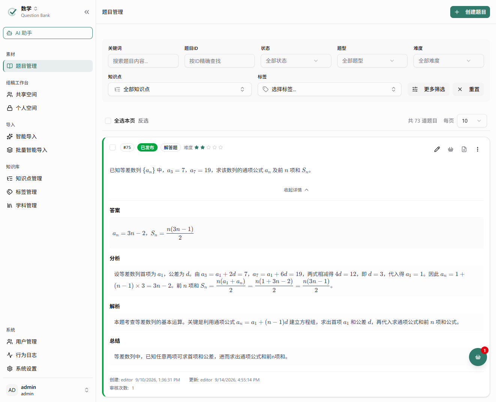
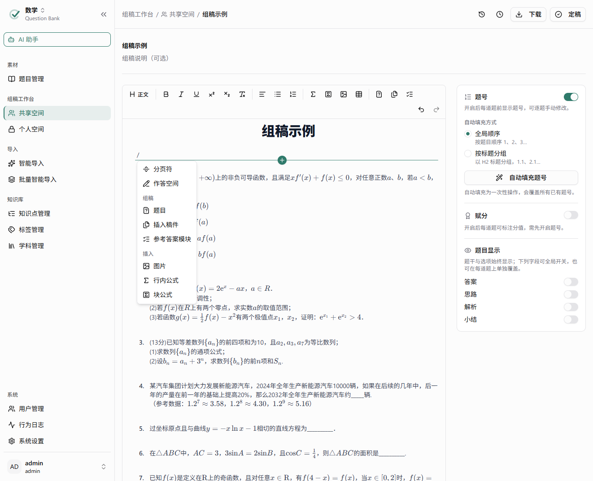

# QuestionBank —— AI 原生的题库与组稿系统

**QuestionBank** 是面向教师与教研团队的 AI 原生题库与组稿系统，覆盖 AI 智能导入、多学科题库管理、知识点匹配、审核发布与稿件编排。支持 Windows 桌面版和服务器版，既可个人使用，也可在局域网或团队环境中协作。

## ✨ 核心功能

| 模块 | 说明 |
| ------ | ------ |
| 组稿工作台 | 个人 / 共享空间与文件夹归档、试题篮收集、自由排版与题号 / 分值 / 显示控制、定稿快照版本，导出 Word / LaTeX |
| 智能导入 | Word / Markdown / 图片，以及带本地图片的 .zip 或整个文件夹；AI 智能抽取或标签精准解析，三步流程（上传 → 审核 → 入库）。详见 [智能导入](https://gygy-open.github.io/question-bank/features/import) |
| 题库管理 | 多条件筛选、批量操作、知识点 / 标签关联、母子题结构、富文本 + 表格 + LaTeX、公开 / 私有可见性、软删除 |
| AI 助手 | 对话中智能找题、创建稿件，并对当前稿件提出增删 / 移动 / 分值等修改；改动先预览，由你应用或放弃 |
| 知识点体系 | 按学科组织的树形知识点，向量化入库，支持 RAG 自动匹配 |
| 学科 & 权限 | 多学科体系、按学科授予只读 / 可编辑 / 学科负责人角色、成员管理。详见 [权限与角色](https://gygy-open.github.io/question-bank/admin/permissions) |
| 标签管理 | 标签分类管理、Excel 批量导入 |
| 审核工作流 | 草稿 → 待审 → 发布 → 归档，审核日志完整记录 |
| AI 对话 | 多模型聊天（支持图片），可选 Provider / Model，对话历史持久化 |
| 用户 & 登录 | 用户管理、登录统计 |
| 操作审计 | 全局活动日志，支持分页与筛选 |
| 系统设置 | AI Provider / Model 热配置、Prompt Template 管理（超管专属）。详见 [AI 供应商与模型](https://gygy-open.github.io/question-bank/admin/ai-config) |
| 文件预览 | DOCX / Markdown 源文件在线预览 |

## 🚀 快速体验 (Quick Start)

推荐直接下载**桌面版**：一个 Windows 托盘应用，内置后端、前端与 SQLite 数据库，**无需安装数据库或 Docker**，双击安装即可使用。

1. 打开 [GitHub Releases](https://github.com/gygy-open/question-bank/releases)，下载最新的 `QuestionBank-Setup-x.y.z.exe`。
2. 双击运行安装程序，按向导完成安装。
3. 安装后应用以**托盘图标**常驻任务栏右下角，右键 → 「打开题库」进入初始化向导（创建管理员账号）即可使用。

数据统一存放在 `%APPDATA%\QuestionBank`，关闭应用后直接复制该目录即可备份。

详见文档：[安装与首次启动](https://gygy-open.github.io/question-bank/desktop/install) · [个人使用](https://gygy-open.github.io/question-bank/desktop/personal)

## 🌐 其他部署方式

- **局域网共享** — 桌面版打开共享开关，让同网段的同事一起用，无需额外部署。详见 [局域网共享](https://gygy-open.github.io/question-bank/desktop/lan-sharing)。
- **服务器版（Docker Compose）** — 多人协作 / 生产环境，完整 MySQL + ChromaDB 技术栈，直接拉取预构建镜像一键启动，无需本地构建。详见 [Docker Compose 部署](https://gygy-open.github.io/question-bank/server/docker)。

## 📚 文档与反馈

📖 在线文档：<https://gygy-open.github.io/question-bank/>

<table>
  <tr>
    <td align="center">
       
      关注公众号，反馈&获取动态
    </td>
    <td align="center">
       
      激励作者☕，让项目变得更好
    </td>
  </tr>
</table>

## 📄 开源协议

本项目采用 [AGPL-3.0-or-later](./LICENSE) 协议。这意味着：

- ✅ 自由使用、修改、分发
- ✅ 商业使用
- ⚠️ **通过网络提供服务时**，必须公开你的修改代码
- ⚠️ 衍生作品必须使用相同的 AGPL 协议

## 🤝 贡献指南

欢迎提交 Issue 和 Pull Request。开发环境、项目架构与代码约定请参阅：

- [贡献指南](./CONTRIBUTING.md)
- [开发文档](https://gygy-open.github.io/question-bank/development/local-setup)
- [架构文档](https://gygy-open.github.io/question-bank/development/architecture)
