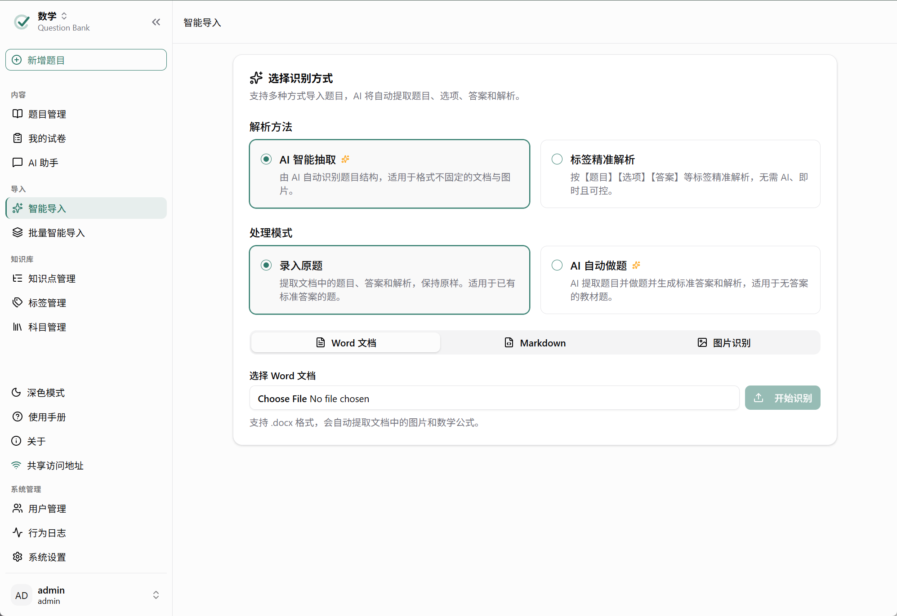

# Question Bank —— AI 原生的题库系统



📖 在线文档：<https://gygy-open.github.io/question-bank/>

<table>
  <tr>
    <td align="center">
      <br />
      关注公众号，反馈&获取动态
    </td>
    <td align="center">
      <br />
      觉得有帮助，激赏作者 ☕
    </td>
  </tr>
</table>

## 快速体验 (Quick Start)

推荐直接下载**桌面版**：一个 Windows 托盘应用，内置后端、前端与 SQLite 数据库，**无需安装数据库或 Docker**，双击安装即可使用。

1. 打开 [GitHub Releases](https://github.com/gygy-open/question-bank/releases)，下载最新的 `QuestionBank-Setup-x.y.z.exe`。
2. 双击运行安装程序，按向导完成安装。
3. 安装后应用以**托盘图标**常驻任务栏右下角，右键 → 「打开题库」进入初始化向导（创建管理员账号）即可使用。

数据统一存放在 `%APPDATA%\QuestionBank`，关闭应用后直接复制该目录即可备份。

详见文档：[安装与首次启动](https://gygy-open.github.io/question-bank/desktop/install) · [个人使用](https://gygy-open.github.io/question-bank/desktop/personal)

## 其他部署方式

- **局域网共享** — 桌面版打开共享开关，让同网段的同事一起用，无需额外部署。详见 [局域网共享](https://gygy-open.github.io/question-bank/desktop/lan-sharing)。
- **服务器版（Docker Compose）** — 多人协作 / 生产环境，完整 MySQL + ChromaDB 技术栈，一键启动。详见 [Docker Compose 部署](https://gygy-open.github.io/question-bank/server/docker)。

## 核心特性

- **AI 原生**：从导入、知识点匹配到答案解析全流程由大模型驱动，而非事后附加的插件功能
- **双形态部署**：同一套代码既是「双击即用」的 Windows 桌面版（内置 SQLite），也是 Docker 一键起的服务器版（MySQL + ChromaDB）
- **隐私隔离**：核心业务与向量数据留在本地/内网，只把脱敏题目文本发给 AI，数据库与 AI 服务物理隔离
- **专业内容**：多题型 + 富文本 + LaTeX 公式，覆盖理科出题场景；填空支持多解
- **可控可审计**：草稿 → 待审 → 发布 → 归档 的审核工作流，配合软删除与全局操作日志
- **AI 供应商自由**：Gemini、OpenAI 及所有 OpenAI 兼容 API（DeepSeek、通义、私有部署等），配置存于数据库、可热切换

## 主要功能

| 模块 | 说明 |
|------|------|
| 智能导入 | 上传 Word / Markdown / 图片，AI 自动抽取结构化题目（三步流程：上传 → 审核 → 入库） |
| 题库管理 | 多条件筛选、批量操作、知识点/标签关联、母子题结构编辑、软删除 |
| 知识点体系 | 按学科组织的树形知识点，向量化入库，支持 RAG 自动匹配 |
| AI 对话 | 多模型聊天（支持图片），可选 Provider / Model，对话历史持久化 |
| 审核工作流 | 草稿 → 待审 → 发布 → 归档，审核日志完整记录 |
| 学科 & 标签 | 学科 CRUD、标签分类管理 |
| 用户 & 权限 | 用户管理、角色控制、登录统计 |
| 操作审计 | 全局活动日志，支持分页与筛选 |
| 系统设置 | AI Provider / Model 热配置、Prompt Template 管理（超管专属） |
| 文件预览 | DOCX / Markdown 源文件在线预览 |

## 架构与设计

系统采用前后端分离 + AI 服务解耦的设计，支持桌面版（SQLite）与服务器版（MySQL + ChromaDB）两种形态，并对核心数据与外部 AI 服务做隔离。

完整的架构总览、安全隔离设计、技术架构图与知识点 RAG 流程图，详见 [架构文档](https://gygy-open.github.io/question-bank/development/architecture)。

## 本地开发

### 技术栈

| 层 | 技术 |
|---|---|
| 前端 | Nuxt 4 (SPA) · Vue 3.5 · TypeScript · Tailwind v4 · Shadcn UI · Tiptap · KaTeX · MathLive |
| 后端 | Python 3.13 · FastAPI · SQLAlchemy 2.0 (Async) · Alembic · Pydantic |
| 数据 | MySQL 8 · ChromaDB · 本地文件系统 |
| AI | Google Gemini · OpenAI 兼容 API |
| 部署 | Docker Compose · Nginx |

### 快速上手

```bash
# 后端
cd backend && uv sync && uv run alembic upgrade head
uv run fastapi dev app/main.py        # 另开终端跑 uv run python -m app.worker

# 前端
cd frontend && pnpm install && pnpm dev
```

完整的环境准备、目录结构、后端 / 前端约定与 AI 服务配置，详见文档：[本地开发](https://gygy-open.github.io/question-bank/development/local-setup) · [后端约定](https://gygy-open.github.io/question-bank/development/backend) · [前端约定](https://gygy-open.github.io/question-bank/development/frontend)

## 开源协议

本项目采用 [AGPL-3.0-or-later](./LICENSE) 协议。这意味着：

- ✅ 自由使用、修改、分发
- ✅ 商业使用
- ⚠️ **通过网络提供服务时**，必须公开你的修改代码
- ⚠️ 衍生作品必须使用相同的 AGPL 协议

## 贡献指南

欢迎贡献！请阅读 [CONTRIBUTING.md](./CONTRIBUTING.md)。
