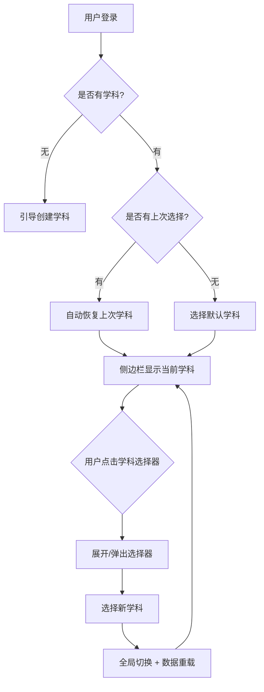

# 全局学科选择器 UI/UX 设计

**功能**: 多学科支持与全局学科切换  
**关联 PRD**: [multi-subject-support.md](../specs/multi-subject-support.md)  
**日期**: 2026-08-04  
**状态**: 待实现

---

## 1. 用户流程



---

## 2. 线框设计

### 2.1 侧边栏展开状态

```
┌─────────────────────────────┐
│ 🎓 题库系统                 │
├─────────────────────────────┤
│ 📐 数学 ▼                   │ ← 学科选择器
├─────────────────────────────┤
│ ➕ 新增题目                 │
│ 📚 题目管理                 │
│ 📄 我的试卷                 │
│ ✨ 智能导入                 │
│   ...                       │
└─────────────────────────────┘
```

**说明**:
- 位置: Logo 正下方，导航菜单上方
- 宽度: 与侧边栏同宽（充满）
- 视觉: 与其他菜单项同高，但背景色区分（`bg-primary/5`）

### 2.2 侧边栏折叠状态（Icon Only）

```
┌───┐
│ 🎓│
├───┤
│[数]│ ← 学科首字徽章
├───┤
│ ➕│
│ 📚│
│ 📄│
│   │
└───┘
```

**说明**:
- 显示: 学科名称首字，方形徽章
- 交互: hover 显示 tooltip "当前学科: 数学"，点击弹出 Popover
- 视觉: `bg-primary text-primary-foreground`

### 2.3 Popover 选择器（折叠时）

```
┌───┐     ┌──────────────────┐
│[数]│────→│ 搜索学科...      │
└───┘     ├──────────────────┤
          │ ✓ 数学           │ ← 当前选中
          │   物理           │
          │   化学           │
          │   英语           │
          └──────────────────┘
```

**说明**:
- 组件: Shadcn `Popover` + `Command`
- 定位: `side="right"` align="start"
- 宽度: `w-[200px]`
- 功能: 支持搜索过滤

---

## 3. 组件清单

### 3.1 新增组件

| 组件 | 路径 | 依赖 |
|------|------|------|
| `SubjectSelector.vue` | `frontend/app/components/SubjectSelector.vue` | Shadcn Select/Popover/Command |

### 3.2 修改组件

| 组件 | 路径 | 变更 |
|------|------|------|
| `AppSidebar.vue` | `frontend/app/components/AppSidebar.vue` | SidebarHeader 中插入 SubjectSelector |

### 3.3 新增 Composable

| Composable | 路径 | 职责 |
|-----------|------|------|
| `useSubjectContext.ts` | `frontend/app/composables/useSubjectContext.ts` | 管理全局学科状态、持久化、切换逻辑 |

---

## 4. 状态矩阵

| 状态 | 展开视觉 | 折叠视觉 | Tooltip | 可交互 |
|------|---------|---------|---------|--------|
| **正常** | `📐 数学 ▼` | `[数]` 蓝色徽章 | "当前学科: 数学" | ✅ |
| **无学科** | `⚠️ 请选择学科` | `[?]` 红色边框 | "系统暂无学科，点击创建" | ✅ 跳转学科管理 |
| **加载中** | Skeleton | 脉冲灰色方块 | "加载中..." | ❌ |
| **切换中** | `数学 ⟳` 旋转图标 | `[数]` + spinner | "正在切换..." | ❌ 禁用再次点击 |
| **错误** | `数学 ⚠️` 警告图标 | `[数]` 红色描边 | 显示错误信息 | ✅ 重试 |

---

## 5. 交互规格

### 5.1 展开状态交互

```vue
<Select v-model="currentSubjectId" @update:model-value="handleSubjectChange">
  <SelectTrigger class="w-full">
    <SelectValue>
      <div class="flex items-center gap-2">
        <Library class="size-4" />
        <span>{{ currentSubject?.name || '选择学科' }}</span>
      </div>
    </SelectValue>
  </SelectTrigger>
  <SelectContent>
    <SelectItem v-for="s in subjects" :key="s.id" :value="String(s.id)">
      <div class="flex items-center justify-between w-full">
        <span>{{ s.name }}</span>
        <Check v-if="s.id === currentSubjectId" class="size-4" />
      </div>
    </SelectItem>
  </SelectContent>
</Select>
```

**行为**:
- 点击 trigger → 展开下拉列表
- 选择项 → 触发 `handleSubjectChange`
- 自动关闭下拉 + 全局切换

### 5.2 折叠状态交互

```vue
<Popover v-model:open="isPopoverOpen">
  <PopoverTrigger as-child>
    <SidebarMenuButton :tooltip="`当前学科: ${currentSubject?.name || '未选择'}`">
      <div class="flex size-8 items-center justify-center rounded-md bg-primary text-primary-foreground">
        <span class="text-sm font-semibold">{{ currentSubject?.name?.[0] || '?' }}</span>
      </div>
    </SidebarMenuButton>
  </PopoverTrigger>
  <PopoverContent side="right" align="start" class="w-[200px] p-0">
    <Command>
      <CommandInput placeholder="搜索学科..." />
      <CommandList>
        <CommandEmpty>未找到学科</CommandEmpty>
        <CommandGroup>
          <CommandItem
            v-for="s in subjects"
            :key="s.id"
            :value="String(s.id)"
            @select="handleSubjectChange(s.id); isPopoverOpen = false"
          >
            <Check v-if="s.id === currentSubjectId" class="mr-2 size-4" />
            <span>{{ s.name }}</span>
          </CommandItem>
        </CommandGroup>
      </CommandList>
    </Command>
  </PopoverContent>
</Popover>
```

**行为**:
- 点击徽章 → 弹出 Popover（右侧）
- 支持输入搜索过滤
- 选择项 → 切换学科 + 关闭 Popover

### 5.3 切换逻辑

```ts
const handleSubjectChange = async (newId: number) => {
  if (isSwitching.value) return  // 防抖
  
  isSwitching.value = true
  try {
    // 1. 前端立即切换（乐观更新）
    currentSubjectId.value = newId
    
    // 2. 持久化到 localStorage
    localStorage.setItem('currentSubjectId', String(newId))
    
    // 3. 同步到后端（后台静默）
    await $api('/users/me/last_subject', {
      method: 'PUT',
      body: { subject_id: newId }
    })
    
    // 4. 触发全局事件（各模块监听并重载数据）
    emitter.emit('subject-changed', newId)
    
    toast.success(`已切换到 ${subjects.value.find(s => s.id === newId)?.name}`)
  } catch (err) {
    // 回滚
    currentSubjectId.value = previousSubjectId
    toast.error('切换学科失败')
  } finally {
    isSwitching.value = false
  }
}
```

---

## 6. 响应式规则

| 侧边栏状态 | 选择器行为 | CSS Class |
|-----------|-----------|-----------|
| **展开** (`default`) | 显示完整 Select | `group-data-[collapsible=icon]:hidden` |
| **折叠** (`icon`) | 显示首字徽章 + Popover | `group-data-[collapsible=icon]:flex hidden` |
| **移动端** (`offcanvas`) | 与展开状态相同 | - |

**实现**:
```vue
<!-- 展开时显示 -->
<div class="group-data-[collapsible=icon]:hidden">
  <Select>...</Select>
</div>

<!-- 折叠时显示 -->
<div class="group-data-[collapsible=icon]:flex hidden">
  <Popover>...</Popover>
</div>
```

---

## 7. 可访问性清单

- [x] **语义化 HTML**: `<Select>` / `<Popover>` 使用原生 ARIA 属性
- [x] **键盘导航**:
  - 展开: `Space`/`Enter` 打开，`↑`/`↓` 选择，`Enter` 确认，`Esc` 取消
  - 折叠: `Space`/`Enter` 打开 Popover，`/` 聚焦搜索框
- [x] **屏幕阅读器**:
  - 展开: `aria-label="选择工作学科，当前: 数学"`
  - 折叠: `aria-label="当前学科: 数学，按下以切换"`
- [x] **焦点管理**: 切换后焦点回到 trigger
- [x] **高对比度**: 边框 `border-2`，徽章背景对比度 ≥ 4.5:1
- [x] **动画尊重**: 遵守 `prefers-reduced-motion`

---

## 8. 视觉样式

### 8.1 展开状态样式

```css
/* 选择器 trigger */
.subject-selector-trigger {
  @apply w-full h-10 px-3 rounded-md border border-input bg-background;
  @apply hover:bg-accent hover:border-accent-foreground/20;
  @apply focus-visible:ring-2 focus-visible:ring-ring;
}

/* 当前选中项高亮 */
.subject-selector-trigger[data-state="open"] {
  @apply bg-accent border-accent-foreground/30;
}

/* 切换中状态 */
.subject-selector-trigger.switching {
  @apply opacity-60 pointer-events-none;
}
```

### 8.2 折叠状态样式

```css
/* 首字徽章 */
.subject-badge {
  @apply flex size-8 items-center justify-center;
  @apply rounded-md bg-primary text-primary-foreground;
  @apply font-semibold text-sm;
  @apply hover:bg-primary/90 transition-colors;
}

/* 无学科警告 */
.subject-badge-empty {
  @apply bg-destructive/10 text-destructive border-2 border-destructive/50;
}
```

### 8.3 Popover 样式

```css
.subject-popover {
  @apply w-[200px] p-0 shadow-lg border;
}

.subject-popover .command-input {
  @apply border-b;
}

.subject-popover .command-item {
  @apply px-3 py-2 cursor-pointer;
  @apply hover:bg-accent hover:text-accent-foreground;
}

.subject-popover .command-item[data-selected] {
  @apply bg-accent;
}
```

---

## 9. 边界场景处理

### 9.1 无学科（空系统）

**触发**: 新部署系统，尚未创建学科

**UI**:
```
展开: [⚠️ 请先创建学科]  （红色，点击跳转 /subjects?create=true）
折叠: [?]  （红色边框）
```

**逻辑**:
```ts
if (!subjects.value?.length) {
  return {
    placeholder: '请先创建学科',
    disabled: false,
    onClick: () => router.push('/subjects?create=true')
  }
}
```

### 9.2 学科被删除

**触发**: 当前选中的学科被管理员删除

**降级策略**:
```ts
watch(subjects, (newSubjects) => {
  if (currentSubjectId.value && !newSubjects.some(s => s.id === currentSubjectId.value)) {
    // 自动切换到第一个学科
    const fallback = newSubjects[0]
    if (fallback) {
      currentSubjectId.value = fallback.id
      toast.warning(`原学科已删除，已自动切换至 ${fallback.name}`)
    } else {
      currentSubjectId.value = null
      toast.error('所有学科已被删除，请先创建学科')
    }
  }
})
```

### 9.3 网络错误（切换失败）

**触发**: 后端同步失败

**处理**:
- 前端已切换（乐观更新）
- 后台静默重试 3 次
- 失败后回滚 + toast 提示
- localStorage 仍保留（下次启动恢复）

---

## 10. 性能优化

| 项目 | 策略 |
|------|------|
| **学科列表缓存** | `useAPI` 自动缓存，手动刷新用 `refresh()` |
| **切换防抖** | `isSwitching` 标志防止连续点击 |
| **后端同步** | 异步静默执行，不阻塞 UI |
| **懒加载** | Popover 内容仅在打开时渲染 |

---

## 11. 实现检查清单

### Phase 1: 核心功能（Must Have）

- [ ] 创建 `useSubjectContext` composable
  - [ ] 状态管理（currentSubjectId, subjects）
  - [ ] 切换逻辑（handleSubjectChange）
  - [ ] localStorage 持久化
  - [ ] 事件总线（subject-changed）
- [ ] 创建 `SubjectSelector.vue` 组件
  - [ ] 展开状态（Select）
  - [ ] 折叠状态（Popover + Command）
  - [ ] 响应式切换（`group-data-[collapsible=icon]`）
- [ ] 修改 `AppSidebar.vue`
  - [ ] SidebarHeader 插入 SubjectSelector
  - [ ] 调整间距与样式
- [ ] 各功能模块监听 `subject-changed` 事件
  - [ ] 题目列表（`pages/questions/index.vue`）
  - [ ] 知识点管理（`pages/knowledge-points/index.vue`）
  - [ ] 标签管理（`pages/tags/index.vue`）
  - [ ] 批量导入（`pages/import/smart.vue`）

### Phase 2: 增强体验（Should Have）

- [ ] 后端 API 实现
  - [ ] `PUT /api/v1/users/me/last_subject`
  - [ ] 返回更新后的用户信息
- [ ] 首次登录引导弹窗
- [ ] 无学科状态保护与引导

### Phase 3: 锦上添花（Could Have）

- [ ] 切换动画（fade + slide）
- [ ] 最近使用学科记录（LocalStorage）
- [ ] 学科收藏/常用标记

---

## 12. 测试场景

| 场景 | 操作 | 预期结果 |
|------|------|---------|
| **正常切换** | 点击"数学" → 选择"物理" | ✅ 侧边栏显示"物理"，题目列表刷新为物理题目 |
| **折叠切换** | 折叠侧边栏 → 点击徽章 → 选择新学科 | ✅ Popover 弹出，选择后关闭，全局切换 |
| **刷新恢复** | 切换到"化学" → 刷新页面 | ✅ 仍显示"化学"（localStorage 恢复） |
| **无学科** | 清空所有学科 → 重新加载 | ✅ 显示"请先创建学科"，点击跳转学科管理 |
| **学科删除** | 当前"数学" → 管理员删除"数学" | ✅ 自动切换到首个学科 + toast 提示 |
| **网络错误** | 切换学科时后端宕机 | ✅ 前端已切换，后台重试，失败后 toast 提示 |
| **键盘导航** | Tab 聚焦 → Space 打开 → ↓ 选择 → Enter 确认 | ✅ 全程无鼠标可操作 |
| **屏幕阅读器** | NVDA/VoiceOver 读取 | ✅ 播报"当前学科: 数学，按下以切换" |

---

## 13. 移交给实施工程师

**依赖资源**:
- [x] Shadcn UI 组件：Select, Popover, Command
- [x] lucide-vue-next 图标：Library, Check, ChevronDown
- [x] mitt 事件总线（用于 subject-changed）

**参考现有代码**:
- `AppSidebar.vue` - 侧边栏结构
- `useAPI.ts` - API 调用模式
- `useAuth.ts` - 状态管理参考

**关键注意事项**:
1. ⚠️ **不要破坏现有侧边栏布局**，在 SidebarHeader 最后一项插入
2. ⚠️ **必须处理折叠/展开两种状态**，使用 `group-data-[collapsible=icon]`
3. ⚠️ **事件总线命名统一**：`subject-changed`，payload 为 `{ subjectId: number }`
4. ⚠️ **降级处理必须实现**：学科被删除的自动切换逻辑

---

## 更新日志

| 日期 | 变更 |
|------|------|
| 2026-08-04 | 初始版本，确定侧边栏 Header 方案 |
