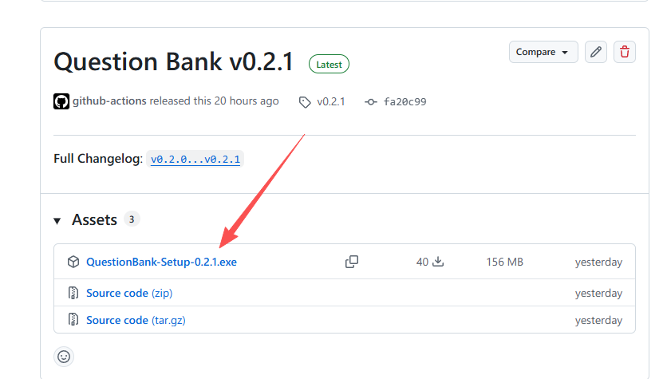
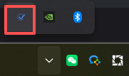

# 安装与首次启动

桌面版是一个 Windows 托盘应用，内置后端、前端与 SQLite 数据库，**无需安装数据库或 Docker**，双击安装即可使用。

## 系统要求

- Windows 10 / 11（64 位）
- AI 功能需要可访问的 AI 供应商，如：Gemini / OpenAI / 阿里云等。

## 下载与安装

1. 打开 [GitHub Releases](https://github.com/gygy-open/question-bank/releases)，下载最新的 `QuestionBank-Setup-x.y.z.exe`。



2. 双击运行安装程序（需要管理员权限）。
3. 按向导完成安装，可选勾选：
   - **开机自启**：登录 Windows 后自动在后台启动。
   - **创建桌面快捷方式**。


## 首次启动

安装完成后，应用会以**托盘图标**形式常驻在任务栏右下角。



右键托盘图标可看到菜单：

| 菜单项 | 说明 |
|--------|------|
| 打开题库 | 用默认浏览器打开题库界面 |
| 局域网共享 | 勾选后开放给同网段访问（**默认关闭**），详见 [局域网共享](/desktop/lan-sharing) |
| 重启 | 重启内置服务 |
| 退出 | 关闭应用与内置服务 |

首次点击「打开题库」后，会进入 **初始化向导**：

1. 选择数据库：桌面版默认使用内置 **SQLite**，无需额外配置。
2. 创建管理员账号（用户名 + 密码）。
3. 完成后即可登录使用。

## 数据存在哪？

桌面版的数据统一存放在：

```
%APPDATA%\QuestionBank
```

在资源管理器地址栏粘贴上面的路径即可打开。常见内容：

- `config.json` — 本地配置（含自动生成的 `SECRET_KEY`）
- SQLite 数据库文件 — 你的题库数据
- `logs\app.log` — 运行日志（排查问题时查看）

::: tip 备份很简单
关闭应用后，直接复制整个 `%APPDATA%\QuestionBank` 目录即可完成备份。详见 [个人使用 · 备份与恢复](/desktop/personal#备份与恢复)。
:::

## 下一步

- 日常使用流程 → [个人使用](/desktop/personal)
- 让同事一起用 → [局域网共享](/desktop/lan-sharing)
- 配置 AI 供应商 → [AI 供应商与模型](/admin/ai-config)
