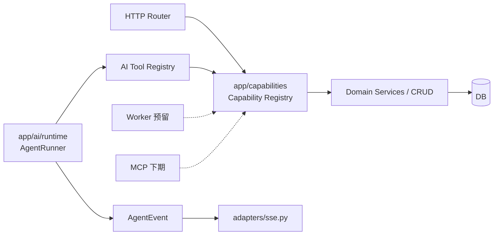

# AI 能力地基：Capability 层 + AgentRunner

> 分支 `feat/ai-capability-foundation` · 7 个提交 · 39 个文件 · +3163 / −1313
> 本期**不含** MCP 服务与前端 client 工具，只打地基。

## 1. 为什么做

原来的 AI 能力有三个结构性问题：

1. **业务逻辑重复**：AI 工具直连 `crud_question`，与 HTTP 端点各写一套编排。想再加 MCP 就得写第三遍。
2. **AI 绕过 RBAC**：`propose_question_draft` 只往参数里塞了 `_user_id`，从不调 `permissions.can()` —— **任何登录用户都能让 AI 建题**。
3. **Agent 循环焊死在 SSE generator 里**：无法被 worker / MCP 复用，也无法单测；工具往返只存在于内存，导致多轮对话上下文断裂。

本期建立两层地基：`app/capabilities/`（业务用例，API 与 AI 共用）与 `app/ai/`（工具注册表 + Agent 运行时）。

## 2. 分层结果



### 命名（重要，容易混）

| 名字 | 位置 | 含义 |
|---|---|---|
| `Permission` | `app/core/permissions.py` | **能不能做** —— 授权谓词。本期由 `Capability` 改名而来 |
| `Capability` | `app/capabilities/` | **能做什么** —— 可执行的业务用例 |

`/me/permissions` 的字段名与枚举值字符串**未变**，前端 `usePermissions.ts` 不需要改。

### 新增模块

| 文件 | 职责 |
|---|---|
| `app/capabilities/base.py` | `Capability` 协议：`load → authorize → execute`；`Authz` 枚举 |
| `app/capabilities/errors.py` | `DomainError` 家族 + 状态码映射（领域层不再抛 `HTTPException`） |
| `app/capabilities/context.py` | `ExecutionContext`（actor / subject / surface），调用方差异收敛于此 |
| `app/capabilities/registry.py` | 单例注册 + `UNGATED_ALLOWLIST` |
| `app/capabilities/questions.py` | 8 个题目写能力 |
| `app/capabilities/compositions.py` | 11 个组稿写能力 |
| `app/ai/contracts.py` | `ToolResult`（content / data / ui）+ `ToolSpec` |
| `app/ai/tools/` | 工具注册表 + questions / library 两组工具 |
| `app/ai/runtime.py` | `AgentRunner`，只吐 `AgentEvent` |
| `app/ai/events.py` | `AgentEvent` 联合类型 |
| `app/ai/adapters/sse.py` | `AgentEvent` → 前端已有的 SSE 事件名 |
| `app/models/agent.py` | `AgentRun` / `AgentStep` |

`app/services/tools.py` 已删除（`git mv` 到 `app/ai/tools/questions.py`，保留历史）。

### 提交

| Commit | 内容 |
|---|---|
| `205a5ea` | `Capability` → `Permission` 改名（纯机械，不留别名） |
| `c9245f4` | Capability 骨架 + `DomainError` handler + `deps.api_context()` |
| `4b3eb96` | questions 8 个写能力，端点收缩为 `capabilities.run` |
| `1568d66` | 组稿服务 `HTTPException` → `DomainError`（约 40 个 raise 调用点零改动） |
| `169e106` | 组稿 11 个写能力 |
| `76e3dc7` | AI 工具走 `capabilities.run` |
| `3e5665f` | AgentRunner 抽离 + 迁移 `d4e5f6a7b8c9` |

## 3. 对外契约：零变化

这是本次改造的验收红线，也是「既有 353 个测试一行没改就全绿」的原因：

- **HTTP**：路由、查询参数、`response_model`、状态码、错误 `detail` 文案全部保持。`deps.require` 的 403 文案 `"The user doesn't have enough privileges"` 被 `Forbidden` 逐字复现；题目「不可见 → 404 而非 403」的防枚举语义保留。
- **SSE**：事件名与 payload 形状不变（`message` / `action` / `action_result` / `proposal` / `message_meta` / `done`）。新的 `AgentEvent` envelope 只在后端内部流转，由 `adapters/sse.py` 翻译回旧事件名。
- **前端**：本期**没有改动任何前端文件**。

## 4. 有意的行为变更（三处）

### 4.1 AI 工具受 RBAC 约束（安全修复）

`propose_question_draft` / `propose_questions_batch` 现在走 `capabilities.run("question.create")`。

- viewer 让 AI 建题会被拒；错误文本回喂给模型自我纠正，**不中断对话**。
- `args["_user_id"]` 注入模式废除，改传 `ExecutionContext`。

### 4.2 工具往返落库（修 bug）

此前带 `tool_calls` 的历史消息被整条 `continue` 跳过，模型看不见自己上一轮做过什么，会反复重复同一次工具调用。

现在 `role=assistant`（带 `tool_calls`）与 `role=tool` 都写入 `chat_messages`（新增 `run_id` / `tool_call_id`），重建上下文时成对还原。它们**只是模型上下文，不进用户可见的对话记录** —— `crud_chat._transcript_only()` 负责过滤。更早轮次的工具结果会被压缩成一行占位，防止历史无限膨胀。

### 4.3 预算控制

裸 `for _ in range(5)` 换成 `RunBudget(max_turns=5, max_tool_calls=20, wall_clock_s=180)`。

## 5. 数据库迁移

`d4e5f6a7b8c9_agent_runs_and_steps`（新 head，`down_revision = c3d4e5f6a7b8`）：

- 新表 `agent_runs` / `agent_steps`
- `chat_messages` 增加 `run_id` / `tool_call_id`

要点：

- **手写的**，不是 autogenerate。当时 MySQL 没起，`alembic revision --autogenerate` 连不上会一直挂住；后来 MySQL 起来后复核过，autogenerate 也**不会**生成正确的 downgrade（见下条），所以保持手写 + `command.check` 守门。
- 与模型零漂移由 `tests/test_migrations.py::test_no_model_migration_drift`（`alembic check`）保证。
- JSON 列一律 `sa.JSON()`（SQLite 桌面/测试 + MySQL 服务端双目标）。
- **`downgrade()` 里 `chat_messages` 的三步顺序是被两个方言夹出来的，别乱动**：
  1. `drop_constraint(FK)` —— MySQL 要求先删外键，否则删索引报 `1553: Cannot drop index ... needed in a foreign key constraint`
  2. `drop_index` —— SQLite 的 batch 重建要求先删索引，否则重建时索引指向已删列
  3. `drop_column`
  最初写成「先删索引再删外键」，SQLite 测试全绿但**在 MySQL 上必炸** —— SQLite 的 batch 是整表重建，顺序无所谓，掩盖了问题。
- 两张 agent 表的 downgrade 直接 `op.drop_table`，不先单独 drop FK 依赖的索引（同样是 1553）。
- 已在 **SQLite 与真实 MySQL 两边**都跑通 upgrade → downgrade → upgrade。
- **不需要数据迁移**：旧代码从未写入过带 `tool_calls` 的 assistant 行（那段 `create` 一直是注释掉的），没有孤儿工具消息。

## 6. 已知鉴权缺口（本期只登记，未修）

`app/capabilities/registry.py` 的 `UNGATED_ALLOWLIST` 记录了 14 个 `Authz.NONE` 的能力 —— 它们**在迁移之前就没有任何鉴权**，本期只搬不改行为：

- `question.batch_create`、`question.review`、`question.batch_confirm`
- 组稿域全部 11 个写能力（历史上只靠 scope/owner 可见性，没有 Permission 门禁）

`tests/test_capability_registry.py` 断言这个集合**完全相等**：新增一个漏权限的能力会红，补完门禁后忘了摘白名单也会红。

> 建议下期第一件事是补组稿门禁（需同时给 148 个既有 composition 测试补学科成员关系），优先级高于 MCP。

## 7. 刻意没做的事

| 事项 | 原因 |
|---|---|
| 工具 JSON Schema 用 pydantic 自动生成 | Gemini 的 `types.FunctionDeclaration` 不吃 `$ref` / `$defs` / `anyOf`；且这几个工具面向 LLM 的松散形状本来就不等于 capability 的严格入参。已写进 `ToolSpec` docstring，别顺手「优化」 |
| 新 SSE envelope 对外暴露 | 等前端 client 工具（需要 interrupt/resume）落地时再谈协议改版 |
| knowledge_points / tags 域迁移 | 同构样板 CRUD，本期无第二个 surface 消费，抽层无收益 |
| 读端点、`batch-legacy`、导出端点迁移 | 无授权判定、无领域不变量，不满足纳入标准 |
| `dry_run` 实现 | `ExecutionContext.dry_run` 只是占位字段，等确认流需要预览时再实现 |
| MCP / `ai_access_token` / client 工具 | 本期范围外 |

## 8. 自动化验证（已完成）

```
backend $ uv run python -m pytest -q
399 passed, 1 skipped
```

> 注意：`uv run pytest` 会报 `Permission denied`，必须用 `uv run python -m pytest`。

- 基线 353 → 399，**既有测试零改动**。
- 新增测试：
  - `test_capability_registry.py`（11）—— 注册表契约、`UNGATED_ALLOWLIST` 集合相等、错误码映射
  - `test_capability_permissions.py`（16）—— 题目 update/delete/batch 权限矩阵，含「不可见 → 404」与批量跳过语义
  - `test_ai_tools.py`（9）—— 工具注册表契约 + AI 侧权限矩阵
  - `test_agent_runtime.py`（8）—— 脚本化 `FakeProvider` 驱动：多轮、上下文成对、权限拒绝不中断、工具不存在、两种预算耗尽、run/step 落库
- 迁移：SQLite 与真实 MySQL 两边都跑通 upgrade → downgrade → upgrade；`command.check` 零漂移。
- 冷导入注册表非空：19 个 capability、5 个 tool。

> `tests/test_migrations.py::test_upgrade_head_on_mysql` 仍是 skip —— 它需要 `MYSQL_TEST_URL` 指向一个**可建库的**测试库，而应用账号 `question_bank` 只有本库权限（建 scratch 库会 `1044 Access denied`）。这条留给 CI。

---

## 9. 手动验收清单

### 9.0 准备

```bash
# 后端依赖无变化，无需重装
cd backend
uv run alembic upgrade head        # 不要用 just migrate（recipe 缺 uv run）
uv run python -m pytest -q         # 期望 399 passed, 1 skipped

# 两个终端分别起
uv run fastapi dev app/main.py     # 注意：dev 模式不自动跑迁移，上面手动跑过即可
cd ../frontend && pnpm dev
```

- [ ] `alembic upgrade head` 成功，`alembic current` 显示 `d4e5f6a7b8c9`
- [ ] 后端启动无报错，`/docs` 可打开
- [ ] 前端可登录

> Docker / 桌面版启动会自动执行迁移（`entrypoint.sh` / `run.py --server`），无需额外操作。

### 9.1 题库回归（Phase 3 覆盖面）

用 **editor** 账号：

- [ ] 新建题目成功
- [ ] 编辑已有题目成功
- [ ] 删除自己创建的题目成功
- [ ] 删除**别人**创建的题目 → 403「权限不足」提示
- [ ] 智能导入落库（走 `POST /questions/batch`）成功，导入任务列表出现对应记录
- [ ] 批量删除混合选中（自己的 + 别人的）→ 只删掉自己的，返回的 `deleted_count` 与实际一致，不整批失败
- [ ] 批量修改来源 → 同上，只影响自己创建的
- [ ] 审核通过 / 驳回，状态与审核次数变化符合学科的 `required_review_count`

用 **viewer** 账号：

- [ ] 看不到「新建题目」入口；直接调 `POST /questions` 返回 403
- [ ] 编辑/删除按钮不可用

用 **跨学科的用户**：

- [ ] 访问不属于自己学科的题目详情 → **404**（不是 403，防枚举）

### 9.2 组稿回归（Phase 4 覆盖面）

- [ ] 目录：新建 / 重命名 / 移动到另一目录 / 删除空目录
- [ ] 删除**非空**目录 → 409 冲突提示（不是 500）
- [ ] 新建稿件、编辑标题与描述
- [ ] 从题库「加入稿件」，节点正常出现
- [ ] 排版：调整顺序、切换编号/分值开关、修改题目字段显示，保存成功
- [ ] 并发冲突：两个标签页同时编辑同一稿件，后保存的一方收到 409 提示
- [ ] 题目同步：修改题库原题后，稿件里出现「已过期」标记，点同步后内容更新
- [ ] 定稿生成版本，版本列表与预览正常
- [ ] 导出 DOCX / PDF 正常（导出路径未迁移，属回归验证）
- [ ] 软删除稿件 → 回收站可见 → 恢复成功
- [ ] 创建副本，`revision` 与内容符合预期
- [ ] 私有题禁止加入共享稿件 → 422 提示

### 9.3 AI 对话（Phase 5 / 6，本期重点）

用 **editor** 账号：

- [ ] 普通问答：流式输出正常，无卡顿，结束后气泡内容完整
- [ ] 刷新页面后对话记录完整重现，**没有出现空白气泡或奇怪的 tool 消息**
- [ ] 让 AI「查一下有哪些标签」→ 出现工具调用动作卡片，结果正常
- [ ] 让 AI「出一道题并保存」→ 出现**确认卡片**，点确认后题目入库
      （这条最关键：`[CONFIRM_IMPORT:id]` 正则已删除，改由 `ToolResult.ui` 产出）
- [ ] 让 AI 批量出 3 道题 → 出现**批量确认卡片**，ids 数量正确
- [ ] **连续两轮都触发工具**（例如先「查标签」，再「按这些标签出一道题」）
      → AI 不再重复第一次的工具调用，能正确接着上一轮的结果往下做
      （这是本期修的上下文断裂 bug，务必验）
- [ ] 首轮问答后会话标题自动生成
- [ ] 中途关闭聊天窗口再打开，未读提示与内容正常

用 **viewer** 账号（新行为，务必确认符合预期）：

- [ ] 让 AI 出题并保存 → **被拒绝**，AI 会说明权限不足，**对话不中断**、不报错
- [ ] 数据库里没有产生新题目

### 9.4 数据落库抽查

跑完 9.3 后：

```sql
-- 应有 run 记录，status=done
SELECT id, surface, status, user_id FROM agent_runs ORDER BY created_at DESC LIMIT 5;

-- 每步都有记录，工具步带 latency
SELECT idx, type, tool_name, latency_ms FROM agent_steps
  WHERE run_id = '<上面的 id>' ORDER BY idx;

-- 工具往返已落库，且带 run_id / tool_call_id
SELECT role, tool_call_id, run_id, LEFT(COALESCE(content,''), 40)
  FROM chat_messages WHERE session_id = '<会话 id>' ORDER BY created_at;
```

- [ ] `agent_runs` 有记录且 `status = 'done'`
- [ ] `agent_steps` 里 `assistant` 与 `tool_call` 步骤齐全
- [ ] `chat_messages` 里有 `role='tool'` 的行，但**前端对话记录里看不到它们**

### 9.5 打包冒烟（合并前建议做一次）

```bash
cd backend && just package
```

- [ ] 打包成功
- [ ] 运行生成的可执行文件，托盘启动、界面打开
- [ ] 打包版里能正常建题 + 走一次 AI 对话（验证两个注册表在冻结环境下非空）

> 本期**零新增依赖**，`run.spec` 的 `collect_submodules("app")` 会自动收集 `app.ai` / `app.capabilities`，理论上无影响。但注册表依赖显式 import 触发，值得实测一次。

### 9.6 回滚

若需回滚：

```bash
cd backend && uv run alembic downgrade c3d4e5f6a7b8
git checkout main
```

- [ ] downgrade 成功（`agent_runs` / `agent_steps` 被删除，`chat_messages` 两列被删除）

> 已在真实 MySQL 上验证过。downgrade 会丢弃已落库的工具往返记录与 run 历史，但不影响用户可见的对话内容（那些是普通 `assistant` / `user` 行）。
> ⚠️ MySQL 的 DDL 非事务，若 downgrade 中途失败会留半迁移态，需手动 ALTER 对齐后再 stamp。
