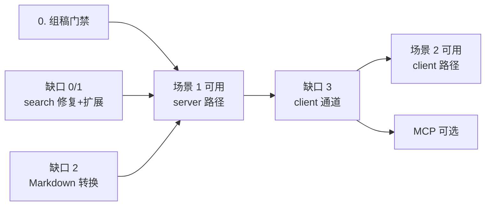

# 组稿 AI 化方案

> 承接 [AI 能力地基](./ai-capability-foundation.md)。本文回答一个问题：19 个 capability 里的 11 个组稿能力，
> 怎么暴露给 AI。**尚未实施**，是下期的设计依据。

## 摘要

1. 组稿排版是**编辑器操作**，不是数据操作 —— 这决定了它的执行位置在前端。
2. 但「生成一份新稿件」和「修改正在编辑的稿件」是两条不同的路径：**生成走 server，编辑走 client**。
3. 暴露给 AI 的接口既不是全量 AST，也不是 command 目录，而是**增量 AST 原语 + node id 寻址**。
4. 落地顺序上，**先做完全不依赖前端 AI 基建的「生成」路径**，就能拿到一个完整可演示的杀手级场景。

---

## 1. 为什么组稿不能照搬题目的做法

题目域的 `question.create` 是**数据操作**：无状态、幂等语义清晰、任何 surface 都能调。组稿不是。

| | 对象 | 状态 | 谁能调 |
|---|---|---|---|
| `question.create` | 数据 | 无状态 | 任何 surface |
| `composition.replace_nodes` | 数据 | 持久化边界 | 任何 surface |
| 「把第 3 题移到最前」 | **会话内文档** | 未持久化、有 undo 栈、有光标 | 只有编辑器 |

第三类跟 VS Code / Figma / Google Docs 里的 AI 是同一类东西：**AI 是编辑器的命令发起者，不是数据库的写入者**。

三条硬约束：

1. **未保存状态**。per-node 的 `props.number` / `props.score` 只在用户点「保存内容」时才落库。AI 若走后端工具，改的是已持久化的 revision —— 要么覆盖用户正在编辑的内容，要么用户一保存就 409。
2. **AST 代数只在前端**。[compositionDocument.ts](../../frontend/app/lib/compositionDocument.ts) 有约 50 个导出的纯函数（`insertRootNodesAfter` / `patchNode` / `normalizeDocument` / `applyQuestionNumbers` / `cloneNodesForInsert`…）。后端 [composition_service.py](../../backend/app/services/composition_service.py) **只有「全量替换」一个粗粒度算子**。在后端做细粒度编辑等于用 Python 重写近千行已测逻辑。
3. **可撤销 + 可预览**。排版是主观的，AI 改错了必须能一键退回；理想形态是先出 diff 让用户确认。client 侧手里有完整 document，两者都天然可做；server 侧几乎做不到。

## 2. 但「生成」是另一条路

| | 生成（新建稿件） | 编辑（修改现有稿件） |
|---|---|---|
| 对象 | 新建的空稿件 | 用户正在编辑、有未保存内容 |
| 指代 | 不需要 | 必须精确（「第一题」） |
| 撤销 | 不需要（不满意就重来） | 必须 |
| diff 预览 | 不需要 | 必须 |
| **路径** | **server**：`composition.create` + 一次性 `replace_nodes` | **client**：AST 原语 → normalize → diff → `PUT /nodes` |

对**全新稿件**而言，`replace_nodes` 的全量替换不是缺陷 —— 稿件本来就是空的，不存在「模型没复现的部分被静默丢失」。反对全量替换的理由在生成场景不成立。

**顺带解决了 MCP**：第三方 Agent 要的正是「生成一份卷子」，不是「把第 3 题上移」。所以即使以后开放 MCP，走的也是同一条 server 路径，零额外设计。

## 3. 暴露给 AI 的接口形状

三选一，选 C：

| | 形态 | 评价 |
|---|---|---|
| A | 全量吐出新 AST（= `replace_nodes` 直接暴露） | ❌ token 爆炸；模型必须完美复现没打算改的部分，否则**静默丢失** |
| B | 固定 command 目录（addQuestion / setScore / …） | ⚠️ 可靠但表达力受限；AI 想「把所有 5 分解答题分组并加小标题」，没有对应 command 就做不了 |
| C | **增量 AST 原语 + node id 寻址** | ✅ 是「直接改 AST」，但增量、可寻址、可 diff |

正确的类比是 `str_replace` 而不是「重写整个文件」—— Claude 改代码也不是把整个文件重吐一遍。

### 3.1 通用原语（纯结构操作）

```
insertNodes(after: nodeId | 'start', nodes[])
removeNodes(nodeIds[])
moveNode(nodeId, before: nodeId | null)
setNodeProps(nodeId, propsPatch)
wrapInModule(nodeIds[], moduleProps)
```

前端已有的纯函数（`insertRootNodesAfter` / `patchNode` / `normalizeDocument`）几乎直接就是它们的实现。

### 3.2 语义原语（AST 里存在「结构性惯用法」的地方）

```
showQuestionFields(nodeId, keys[])
addDetailsModule(nodeId, preset)
```

原因：`question_details` 是 module + 若干 `answer_item` 子节点的组合，还有一层继承
`effectiveQuestionField(node, key) = node.props.show[key] ?? question_display[key]`。
让 AI 用通用原语手搓这棵子树，出错概率极高。复用已有的 `DETAIL_PRESETS` / `createQuestionDetailsModule`。

> **原则**：纯结构操作给通用原语；有结构性惯用法的地方给语义原语。

### 3.3 投影读工具（AI 先看见，才能精确改）

不要把原始 AST 喂给模型 —— `question` 节点的 `content` 是几千 token 的 tiptap JSON。给投影：

```
[n1] heading  「一、选择题」
[n2] question #1234  单选 5分  "下列哪个…"
[n3] question #1235  单选 5分  "…"
       └ [n6] question_details  显示: thinking, analysis
[n4] heading  「二、解答题」
```

只留 id + 类型 + 关键 props + 摘要，上下文成本降一两个数量级。**必须表达 module 的嵌套关系**，不能拍平成一维列表 —— 否则「在第一题后面插入」会有锚点歧义（module 之后还是 question 节点之后）。这正是 `ToolResult.data` 的用武之地。

### 3.4 AI 不拥有的字段

AST 里有一部分字段是**系统拥有**的，开放给 AI 写就会出事：

| 字段 | 为什么 |
|---|---|
| `question` 节点的 `content` | 是**冻结快照**，只能由 `createQuestionNode(question)` 从题库实时生成。AI 自己编 = 稿件里的题跟题库对不上 |
| 节点 `id` | 系统生成（`generateNodeId`） |
| `sourceQuestionNodeId` / `anchorBeforeNodeId` | 软指针，`cloneNodesForInsert` 负责重映射 |

所以 `insertNodes` 的入参不能是「完整的 question 节点」，必须是**引用**：`{type: 'question', questionId: 1234}`，由前端调 `createQuestionNode` 构造。

**AI 提供意图与引用，系统构造节点。** 这不是不信任 AI —— 是这些字段的真值不在 AI 手里。

### 3.5 与 command 层的关系

command 层仍然要有，它是**人机共用的执行层**（UI 按钮也走它），但**不是暴露给 AI 的接口形状**。原语是 command 层的底座，不是 command 目录的一一映射。

```
UI 按钮 ─┐
         ├─→ Command ─→ AST 原语 ─→ compositionDocument 纯函数 ─→ normalize ─→ PUT /nodes
AI 工具 ─┘
```

---

## 4. 场景演练

### 场景 1：「做一个知识点的专题讲义，在题库里找一个题作为例题，并加几道检测题」

| 步骤 | 需要什么 | 现状 |
|---|---|---|
| 理解知识点 | `search_knowledge_points` | ✅ 已有 |
| 找例题 / 检测题 | `search_questions` | ⚠️ 缺知识点过滤（缺口 1）；`q_type` 参数是坏的（缺口 0） |
| 新建稿件 | `composition.create` | ⚠️ capability 有，**没有对应 AI 工具** |
| 写讲义正文 | 插入 `rich_text` 节点 | ❌ AI 要产出 tiptap RichDoc JSON（缺口 2） |
| 插标题、放题 | 组装节点列表 | ⚠️ 需要 server 侧工具 |
| 例题显示解析、检测题隐藏 | `props.show` / `question_details` | ⚠️ 需要语义原语（缺口 4） |
| 打开给用户看 | 导航 | ❌ client tool 通道（缺口 3） |

**结论：这个场景不需要 client AST 原语。** 除了最后「打开页面」，整件事可以在后端一次做完：
`composition.create` → AI 组装节点列表 → `composition.replace_nodes` → 导航。

### 场景 2：「帮我在第一题后面插入一个解题思路」

这个必须走 client，且暴露三个问题：

**A. 「解题思路」是歧义的** —— 两种意思对应完全不同的操作：
- (i) 显示题目**已有的** `thinking` 字段 → `showQuestionFields(n2, ['thinking'])`
- (ii) AI **现写一段**思路文字 → `insertNodes(after: n2, [{type: 'rich_text', markdown: '…'}])`

架构上两条路都必须走得通。澄清本身不需要新机制 —— AI 直接反问，等用户下一条消息，现有 SSE 流够用。

**B. `question_details` 结构复杂** → 见 3.2，需要语义原语。

**C. 锚点歧义** → 见 3.3，投影视图必须表达嵌套。

---

## 5. 缺口清单

| # | 缺口 | 性质 | 成本 | 依赖 |
|---|---|---|---|---|
| 0 | **`search_questions` 的 `q_type` 参数是坏的** | 工具 schema 让模型传 `"选择题" / "填空题" / "解答题"`，但 `questions.q_type` 是 `Enum(QuestionType)` 列，存的是 `single_choice` / `fill_in_the_blank` / `free_response`，`crud_question` 直接 `q_type == <值>` 比对 → SQLAlchemy 在绑定参数时就 `LookupError`，工具返回一句错误给模型。而且枚举只列了 3 种，模型有 5 种。**这是本期之前就存在的 bug，Phase 5 迁移时原样保留了 schema** | 极小 | 无 |
| 1 | `search_questions` 缺知识点 / 标签过滤 | `get_multi_with_filters` **已支持** `knowledge_point_ids` / `tag_ids`，只是工具没暴露 | 极小 | 无 |
| 2 | `rich_text` 节点用 Markdown 入参 | 前端只有 `markdown-it` 做**预览渲染**（`MarkdownPreview.vue`），**没有 md → tiptap RichDoc 转换器**；后端有（`question_content_converter.py`，支持表格与公式） | 中 | 无 |
| 3 | client tool 通道 + 跨页面 resume | 场景 1 的「导航过去」与场景 2 全程都要 | 大 | ADR-001 |
| 4 | 语义原语（details 模块 / 字段显示） | 复用 `DETAIL_PRESETS` | 小 | 3 |
| 5 | 通用 AST 原语 + diff 预览 | 场景 2 的主体 | 中 | 3 |

> **缺口 2 特别说明**：绝不能让 AI 直接吐 tiptap JSON。数学公式要嵌 mathfield 节点、表格是三层嵌套，
> 模型产出的结构错误率会很高，token 也是 Markdown 的好几倍。这一条偷懒，讲义类场景的质量会直接崩掉。
> 两个选项：前端补一个转换器（与后端两份实现，有漂移风险），或让工具走后端转一次。倾向后者。

---

## 6. 实施顺序



1. **组稿门禁**（前置，不可跳过）。11 个组稿能力目前**全在 `UNGATED_ALLOWLIST` 里**，没有 Permission 门禁。AI 一旦能操作组稿，风险从「人手动点错」放大到「AI 批量执行」。需同时给 148 个既有 composition 测试补学科成员关系。
2. **缺口 0 + 1**：修 `q_type`、加知识点过滤。独立、便宜，可以立刻做。
3. **缺口 2 + server 侧组稿工具**（`composition.create` / `replace_nodes` 的工具投影）。
   → **此时「生成专题讲义」已经能跑通**，只差最后打开页面。
4. **缺口 3**：client tool 通道 + 跨页面 resume。解锁导航，也解锁场景 2。
5. **缺口 4 + 5**：AST 原语 + diff 预览 → 场景 2 完整可用。

**第 3 步做完就有一个完整、可演示的杀手级场景，且完全不需要动前端 AI 基建。** 建议以此为下期切入点，先把便宜且完整的那条路走通，再啃 client 通道。

---

## 7. 风险

| 风险 | 缓解 |
|---|---|
| 通用原语让 AI 能自由组合，产出不可预测的排版 | **diff 预览兜底** —— AI 提交一组原语 → 前端内存里 apply + normalize → 算 before/after diff → 用户确认后才写入 |
| 前端成为 AI 能力的一等公民，复杂度上升 | 需要 tool 注册中心、command 层，以及「AI 正在操作画布」的 UI 反馈（否则画布自己动，用户会懵） |
| 跨页面流程（建稿件 → 导航 → 编辑） | run 状态在后端（`agent_run.status = waiting_client`），前端跳转后重连 SSE 续跑。设计成立，但比同页面往返复杂一档 |
| 测试成本转移到 vitest | 仓库前端测试基建偏弱（`nuxi typecheck` 目前是坏的）。组稿 AI 的行为回归会比后端难保障 |
| 两份 Markdown 转换实现漂移 | 优先走后端转换，不在前端复制 |

## 8. 明确不做

- **不把 `composition.replace_nodes` 原样暴露给 LLM**（除新建稿件的一次性写入外）。
- **不在 Python 里重写 AST 代数**。后端只保留「全量替换 + 校验」这一个持久化边界。
- **不给 MCP 开放细粒度编辑**。MCP 只走场景 1 的生成路径。
- **不做 command 目录到 AI 工具的一一映射**。
