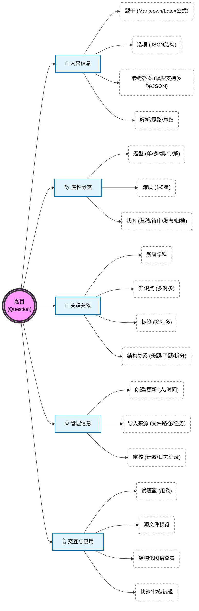
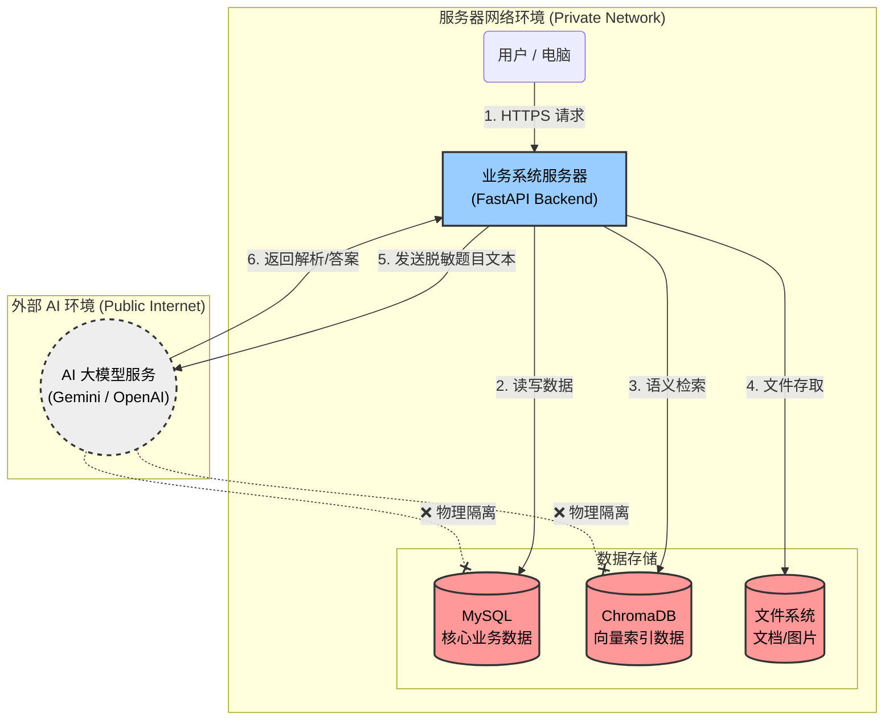
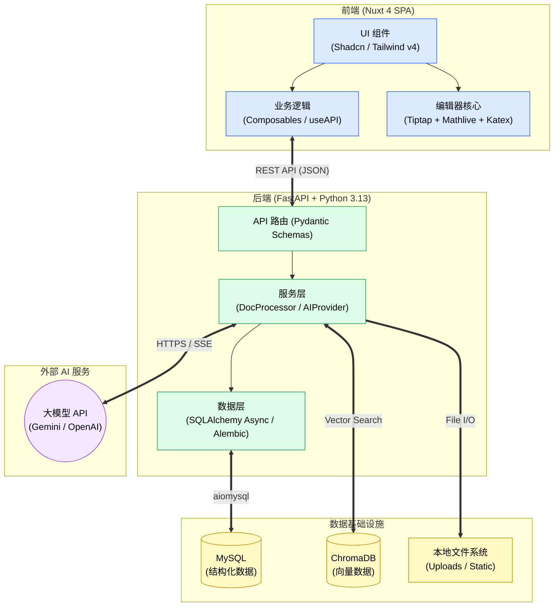
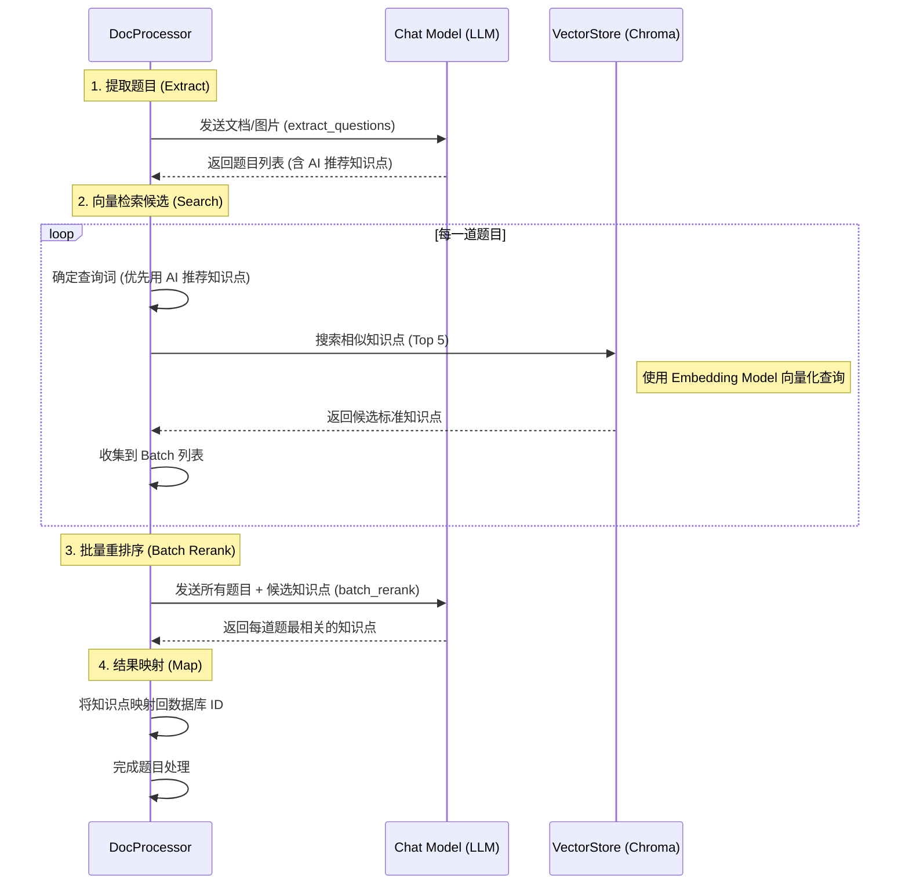

# 架构总览

本页面向开发者与部署者，概述系统的技术栈与分层。

## 技术栈

| 层 | 技术 |
|----|------|
| 后端 | Python 3.13+、FastAPI、SQLAlchemy（Async）、Alembic、Pydantic |
| 前端 | Nuxt 4（SPA）、Vue 3.5+、TypeScript、Tailwind CSS v4、Shadcn UI |
| AI | 多供应商（Gemini / OpenAI 兼容），经 `AIProvider` 接口抽象 |
| 向量库 | ChromaDB |
| 数据库 | MySQL（服务器版） / SQLite（桌面版） |
| 打包 | Docker（服务器版）、PyInstaller + Inno Setup（桌面版） |

## 组件关系

```
                 ┌─────────────────┐
   用户浏览器  →  │  前端 Nuxt SPA   │
                 └────────┬────────┘
                          │ /api
                 ┌────────▼────────┐        ┌──────────────────────┐
                 │  后端 FastAPI    │  ───►  │ AI 供应商             │
                 └───┬────────┬────┘        │ Gemini / OpenAI 兼容  │
                     │        │             └──────────────────────┘
              ┌──────▼──┐  ┌──▼─────────┐
              │ 数据库   │  │ ChromaDB   │
              │MySQL/SQLite│ │ 向量库     │
              └────▲────┘  └──▲─────────┘
                   │          │
              ┌────┴──────────┴────┐
              │ Worker 后台任务      │  ◄── 后端入队(导入等)
              └────────────────────┘
```


## 分层与关键模块

**后端（`backend/app/`）**

- `api/` — 路由（`api/v1/endpoints/*`）
- `crud/` — 数据访问，继承 `crud/base.py:CRUDBase`
- `models/` — SQLAlchemy 模型
- `schemas/` — Pydantic 模型
- `services/` — 业务服务，如 `ai_provider.py`（AI 接口）、`doc_processor.py`（文档解析抽取）
- `core/config.py` — 静态配置
- `worker.py` — 后台任务处理

**前端（`frontend/app/`）**

- `pages/` — 页面路由
- `components/ui/` — UI 组件（Shadcn 风格）
- `composables/` — 如 `useAPI`
- `plugins/api.ts` — API 客户端（自动注入鉴权）

## 部署形态与本架构的关系

- **桌面版**：前端（静态）+ 后端 + Worker + SQLite 全部打进单个可执行文件，以托盘应用运行；ChromaDB 以本地形式使用。
- **服务器版**：各组件为独立容器（见 [Docker Compose 部署](/server/docker)）。

## AI 配置为数据库驱动

AI 供应商 / 模型 / Key 存于数据库（`ai_providers`、`ai_models`），而非环境变量，支持热切换。新增供应商需实现 `app/services/ai_provider.py` 中的 `AIProvider` 接口。

## 图解

### 题目全景视图 (Question Entity Overview)

此图展示了“题目”这一核心实体的全景视图，包含其组成要素、关联信息以及在前端交互中的应用能力。



### 安全架构图 (Security Architecture)

此图展示了系统中各组件的安全隔离设计，确保用户数据和隐私得到保护，同时利用外部 AI 服务进行题目处理。



### 技术架构图 (Technical Architecture)

此图展示了系统的整体技术栈与模块交互关系，供开发人员参考。



### 知识点提取与 RAG 流程 (Knowledge Extraction Workflow)

此图展示了优化的 RAG (Retrieval-Augmented Generation) 流程，特别是批量重排序机制。


