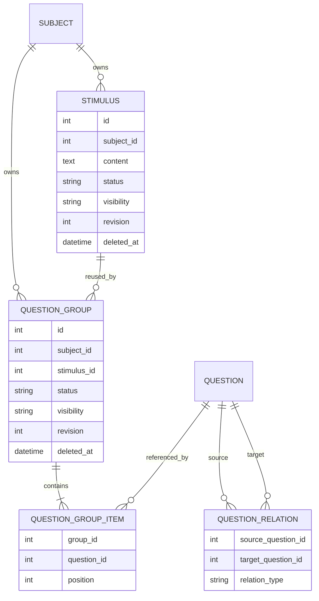

# 文科材料题与题目派生关系设计

> 状态：阶段四题库前端已完成，智能导入审核与题组原生组稿仍待完成
> 实施分支：`feature/humanities-question-groups`  
> 更新日期：2026-09-20

## 背景

原有 `questions.parent_id` 的设计目的，是记录 AI 根据知识点把一道题拆成多道题的派生关系。它表达的是“这道题由哪道题拆出”，并不是阅读理解或材料分析题中的“共享材料包含若干小题”。

两者看起来都有父子结构，但领域语义不同：

- AI 拆题中的来源题和派生题都是可独立作答的题目。
- 材料题中的材料本身通常不可作答，也没有题型、答案或选项。
- 一篇材料可能被多个题组复用，而一道派生题不应因为来源题被删除就随之删除。
- 题组需要稳定的小题顺序、整体版本和组卷语义，题目派生关系不需要。

因此，本次没有把 `parent_id` 扩展成材料题字段，而是拆分为两个独立领域：

1. `Stimulus + QuestionGroup + QuestionGroupItem` 表达材料题。
2. `QuestionRelation` 表达 AI 拆题产生的题目派生谱系。

## 设计原则

### 术语与领域边界

中文用户界面统一使用“题目材料”，避免简称为“材料”；后端模型、API 契约和代码标识继续使用 `Stimulus`。`Question` 是可作答、可评分的题目；`Stimulus` 是不可作答、可复用的上下文；`QuestionGroup` 由一份 `Stimulus` 和若干有序 `Question` 组成，不承担题号、分值或版面；`Composition` 负责具体稿件中的题号、分值和版面。

### 材料与可作答题目分离

`Question` 始终表示可独立作答、可保存答案和参与评分的题目。阅读理解不是新的 `QuestionType`，题组中的小题继续使用单选、多选、判断、填空和解答等现有题型。

`Stimulus` 只保存共享材料及其状态、权限、来源和修订，不包含答案、选项或题型。这样同一篇材料可以被多个题组复用和独立更新。

### 题组使用显式成员关系

`QuestionGroup` 表示一次“材料 + 有序小题”的组合，`QuestionGroupItem` 负责关联已有题目并保存位置。首期业务只支持两层结构，不使用递归树，从模型上避免无限嵌套和环形题组。

### 派生关系不拥有题目生命周期

`QuestionRelation` 是题目之间的有向关系。当前关系类型为 `decomposed_from`：

```text
source_question --decomposed_from--> target_question
原始题目                              AI 拆出的题目
```

删除或解除来源关系不应删除派生题。服务层禁止自关联、重复边、跨学科边和有向环。

### 题库与试卷职责分离

题库保存材料、题组和小题的可复用结构；题号、分值和版面顺序属于具体稿件。材料或题目更新时，已经生成的稿件不应被静默改写。

当前阶段在导入时把题组展开为现有 Composition 的 `rich_text + question` 节点。这个实现能正确生成试卷，但尚未保存题组级引用和修订快照，属于兼容现有 Composition AST 的过渡方案。

该方向与 IMS QTI 的基本思想一致：能够独立作答的问题建模为独立 item，共享材料独立保存，试卷 section 或容器负责组织顺序；只有多个作答点高度耦合时才适合建模为单个 composite item。

## 领域模型



主要数据库约束：

- 同一题组内 `question_id` 唯一。
- 同一题组内 `position` 唯一且必须大于或等于 0。
- 派生关系的来源题和目标题不能相同。
- 相同来源、目标和关系类型的边不可重复。
- 服务层保证材料、题组和成员题目属于同一学科。
- 公开题组不能引用私有材料或私有题目。

## 本次已完成

### 数据模型与迁移

新增了以下模型：

- `Stimulus`：共享材料、权限、状态、来源、metadata、revision 和审计字段。
- `QuestionGroup`：题组、材料引用、权限、状态、revision 和审计字段。
- `QuestionGroupItem`：题组的小题成员及稳定顺序。
- `QuestionRelation`：题目之间的派生关系。

Alembic 迁移会创建对应表，并将合法的历史 `parent_id` 转换为：

```text
parent_id 指向的原题 -> 当前题，relation_type = decomposed_from
```

迁移不会从历史父子结构自动创建材料或题组。自关联、父题不存在和跨学科关系不会被静默迁移，旧 `parent_id` 仍在兼容期保留。

### 材料与题组 API

已增加以下端点：

| 方法 | 路径 | 用途 |
| --- | --- | --- |
| `POST` | `/subjects/{subject_id}/stimuli` | 创建材料 |
| `GET` | `/subjects/{subject_id}/stimuli` | 分页查询材料，支持关键词、状态和可见性筛选 |
| `GET` | `/subjects/{subject_id}/stimuli/{stimulus_id}` | 获取材料 |
| `PUT` | `/subjects/{subject_id}/stimuli/{stimulus_id}` | 更新材料 |
| `POST` | `/subjects/{subject_id}/question-groups` | 创建题组 |
| `GET` | `/subjects/{subject_id}/question-groups` | 分页查询题组，支持关键词、状态、可见性、材料 ID 和题目 ID 筛选 |
| `GET` | `/subjects/{subject_id}/question-groups/{group_id}` | 获取材料及有序小题 |
| `PUT` | `/subjects/{subject_id}/question-groups/{group_id}` | 更新材料引用、成员或顺序 |
| `DELETE` | `/subjects/{subject_id}/question-groups/{group_id}` | 软删除题组 |

更新和删除使用 `expected_revision` 实现乐观锁。版本不匹配时返回 `409`，防止两个编辑者静默覆盖彼此的修改。

题组删除只删除成员关系并软删除题组，不删除材料和题目。私有资源对无权用户按不存在处理，避免泄露资源信息。

### 派生关系兼容

新的批量建题和导入流程不再写入 `questions.parent_id`。旧输入中的嵌套 `children`、`parent_id` 或 `parent_temp_id` 会被转换为 `QuestionRelation(decomposed_from)`。

派生关系服务已经实现：

- 来源题和目标题存在性检查。
- 学科和编辑权限检查。
- 私有题可见性检查。
- 自关联、重复边和有向环检查。
- 并发写入前按学科锁定题目行；SQLite 使用单写者事务作为保守回退。

目前派生关系主要由批量创建和导入流程调用，尚未提供独立的关系管理 REST API。

### 智能导入

导入契约新增：

- `stimuli`：带临时 ID 的材料列表。
- `question_groups`：材料临时 ID 与有序题目临时 ID 列表。
- `question_group_ref`：整卷 outline 中的题组引用。

预检会在写库前验证：

- 题目、材料和题组临时 ID 唯一。
- 材料引用和成员题目引用存在。
- 题组至少包含一道题，且成员不可重复。
- 派生关系不存在自关联和环。
- URL 学科与题目学科一致。
- 公开题组不引用私有材料或题目。
- outline 不引用不存在的题目或题组。

正式导入在同一工作单元内创建 ImportTask、Question、QuestionRelation、Stimulus、QuestionGroup、成员和可选稿件。底层调用使用 `flush`，由外层 capability 统一提交；组稿节点替换失败时，整次导入回滚。

### 当前组稿行为

导入并保存为稿件时，`question_group_ref` 按以下方式展开：

1. 首次遇到某篇材料时生成 `rich_text` 节点。
2. 按 `QuestionGroupItem.position` 生成连续的 `question` 节点。
3. 多个题组复用同一材料时，该材料在同一 outline 解析过程中只渲染一次。
4. 没有 outline 时，根据抽取题目顺序生成回退结构，题组在其第一个成员位置展开。

这保证了现有稿件和导出链路可继续工作，但稿件中只保留展开后的内容快照，没有 `question_group_id`、`group_revision` 或 `stimulus_revision`。

### 题库前端

阶段四已提供以下 SPA 路由：

- `/materials`、`/materials/new`、`/materials/{id}/edit`：材料分页列表、筛选、创建和编辑。
- `/question-groups`、`/question-groups/new`、`/question-groups/{id}/edit`：题组分页列表、筛选、创建和编辑。

题组编辑器支持选择或新建材料、选择或新建题目、拖拽及按钮排序、移除成员、状态/可见性/来源编辑和 revision 冲突处理。公开题组会在前端标记并禁止选择私有材料或私有题目；历史遗留的不兼容组合会保留展示，但必须解决后才能保存，后端仍是最终校验边界。

材料和题组编辑器会保护未保存草稿：路由离开和关闭页面前提示确认；全局学科切换后保留原学科草稿、不重新加载覆盖，并提示用户切回原学科或返回列表。KeepAlive 再激活不会覆盖 dirty 草稿。

材料选择器避免重复选择当前材料，题目选择器避免重复添加已有成员。题组列表删除遇到 revision `409` 时会刷新列表并提示用户重新确认。题库题目项提供“创建派生题”和“查看派生关系”，关系面板使用“来源题/派生题”术语。

## 如何验收

### 自动化测试

在仓库根目录执行：

```bash
cd backend
uv run pytest \
  tests/test_question_groups.py \
  tests/test_api_paper_import.py \
  tests/test_api_question_legacy_batch.py \
  tests/test_importing_extract.py \
  tests/test_importing_review.py \
  tests/test_migrations.py -q
```

当前分支于 2026-09-20 执行结果为：`56 passed, 1 skipped`。跳过项是未设置 `MYSQL_TEST_URL` 时的真实 MySQL 迁移测试；SQLite 测试、模型迁移漂移检查及其余聚焦测试均通过。测试过程中存在一个既有 SQLAlchemy 警告：`subjects` 与 `user` 的相互外键使表排序无法完全解析，本次改动未新增该警告。

前端于 2026-09-20 执行：

```bash
cd frontend
pnpm test
pnpm generate
```

结果为：Vitest `21 passed` 个测试文件、`248 passed` 个测试；Nuxt 静态生成成功并预渲染 24 个路由。生成过程仅有 KaTeX quirks mode、较大 chunk 和 SPA 无 SSR 的既有提示。本次未执行手工浏览器验收，因此不声明视觉或交互手工验收已通过。

重点验收场景：

- 材料可被多个题组复用。
- 题组创建、换序、更新和删除符合 revision 与生命周期约束。
- 数据库拒绝重复成员、重复位置和负数位置。
- 公开题组拒绝私有材料或私有题目。
- 跨学科操作、无权限访问和已删除题目被拒绝。
- 派生关系拒绝自关联、重复边和有向环。
- 历史嵌套题只创建派生关系，不写 `parent_id`，也不误建材料题组。
- 显式材料题导入后，成员顺序与输入一致。
- 共享材料在同一稿件中只展开一次，outline 顺序不变。
- 无效临时引用在写库前失败，不留下部分数据。
- Composition 节点替换失败时，导入产生的所有实体一起回滚。
- Alembic 模型与迁移无漂移，SQLite 迁移链可正向执行。

如配置了 MySQL 测试数据库，再执行：

```bash
TEST_MYSQL_URL='mysql+aiomysql://...' uv run pytest tests/test_migrations.py -q
```

### 手工 API 验收

1. 创建一篇材料，确认返回 `revision = 1`。
2. 创建两个题组并引用同一材料，确认题组 ID 不同而 `stimulus_id` 相同。
3. 用乱序成员位置创建题组，读取时确认按 `position` 返回。
4. 使用正确 `expected_revision` 更新题组，确认 revision 增加；再次使用旧 revision 应返回 `409`。
5. 尝试让公开题组引用私有材料或私有题目，应返回 `422`。
6. 删除题组后确认题组不可读取，但原材料和成员题目仍存在。
7. 导入带 `parent_temp_id` 的拆题结果，确认 `questions.parent_id` 为空且产生 `decomposed_from` 关系。
8. 导入显式材料和题组并保存为稿件，确认材料只出现一次、小题按输入顺序出现。

## 待完成

### 智能导入审核

- 智能导入审核页显示“材料 -> 小题”结构，允许拆组、合组、换序和修正引用。

### 题组原生组稿

- 为 Composition 增加题组级节点或等价的显式引用结构。
- 稿件快照记录 `group_revision`、`stimulus_revision` 及每道题的 `question_revision`。
- 来源发生变化时提示稿件已过期，由用户决定是否刷新，不能自动改写历史版本。
- 导出时按题组边界渲染材料、小题、题号、分值和答案区。
- 支持从题库直接把整个题组加入稿件，而不只是在导入时展开。

### 旧字段下线

- 增加迁移诊断报告，列出自关联、父题缺失、跨学科和软删除状态异常的历史 `parent_id` 数据。
- 完成所有调用方切换后禁止 `parent_id` 写入。
- 移除 Question Schema 中的递归 `parent/children`。
- 移除 CRUD 中固定三层加载和父题删除时递归删除子题的逻辑。
- 数据核验完成后，通过独立迁移删除 `questions.parent_id`。

### 派生关系完善

- 增加派生关系查询、创建和删除 API。
- 明确后续是否增加 `variant_of` 等关系类型。
- 为大规模关系图优化可达性检查，补充并发和性能测试。

### 其他工程工作

- 补充材料和题组列表、分页、搜索及软删除恢复接口。
- 评估材料状态与审核流程是否需要独立审核计数和日志。
- 补充真实 MySQL 的迁移、约束和并发测试。
- 在前后端闭环后更新用户文档，并评估 IMS QTI 导入导出映射；QTI 互操作不属于当前阶段。

## 关键实现位置

- 数据模型：`backend/app/models/question_group.py`
- 数据库迁移：`backend/alembic/versions/9417bea9971b_add_question_groups_and_relations.py`
- Schema：`backend/app/schemas/question_group.py`、`backend/app/schemas/paper_import.py`
- 领域服务：`backend/app/services/question_group_service.py`
- API：`backend/app/api/v1/endpoints/question_groups.py`
- 导入服务：`backend/app/services/paper_import_service.py`
- 组稿转换：`backend/app/services/composition_authoring.py`
- 领域测试：`backend/tests/test_question_groups.py`
- 导入测试：`backend/tests/test_api_paper_import.py`
- 迁移测试：`backend/tests/test_migrations.py`

## 参考

- IMS QTI 2.2 Implementation Guide: <https://www.imsglobal.org/question/qtiv2p2/imsqti_v2p2_impl.html>
- 1EdTech QTI: <https://www.1edtech.org/standards/qti>
