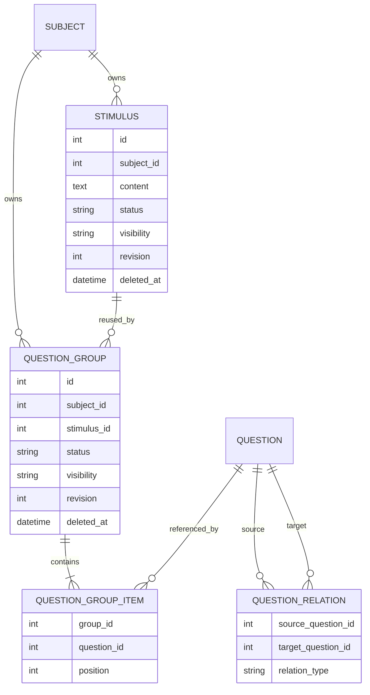

# 文科材料题与题目派生关系设计

> 状态：智能导入、题库管理、题组原生组稿与旧字段下线已完成
> 实施分支：`feature/humanities-question-groups`  
> 更新日期：2026-09-21

## 背景

原有 `questions.parent_id` 的设计目的，是记录 AI 根据知识点把一道题拆成多道题的派生关系。它表达的是“这道题由哪道题拆出”，并不是阅读理解或材料分析题中的“共享材料包含若干小题”。

两者看起来都有父子结构，但领域语义不同：

- AI 拆题中的来源题和派生题都是可独立作答的题目。
- 材料题中的材料本身通常不可作答，也没有题型、答案或选项。
- 一篇材料可能被多个题组复用，而一道派生题不应因为来源题被删除就随之删除。
- 题组需要稳定的小题顺序、整体版本和组卷语义，题目派生关系不需要。

因此，本次没有把 `parent_id` 扩展成材料题字段，而是拆分为两个独立领域：

1. `Stimulus + QuestionGroup + QuestionGroupItem` 表达材料题。
2. `QuestionRelation` 表达 AI 拆题产生的题目派生谱系。

## 设计原则

### 术语与领域边界

中文用户界面统一使用“题目材料”，避免简称为“材料”；后端模型、API 契约和代码标识继续使用 `Stimulus`。`Question` 是可作答、可评分的题目；`Stimulus` 是不可作答、可复用的上下文；`QuestionGroup` 由一份 `Stimulus` 和若干有序 `Question` 组成，不承担题号、分值或版面；`Composition` 负责具体稿件中的题号、分值和版面。

### 材料与可作答题目分离

`Question` 始终表示可独立作答、可保存答案和参与评分的题目。阅读理解不是新的 `QuestionType`，题组中的小题继续使用单选、多选、判断、填空和解答等现有题型。

`Stimulus` 只保存共享材料及其状态、权限、来源和修订，不包含答案、选项或题型。这样同一篇材料可以被多个题组复用和独立更新。

### 题组使用显式成员关系

`QuestionGroup` 表示一次“材料 + 有序小题”的组合，`QuestionGroupItem` 负责关联已有题目并保存位置。首期业务只支持两层结构，不使用递归树，从模型上避免无限嵌套和环形题组。

### 派生关系不拥有题目生命周期

`QuestionRelation` 是题目之间的有向关系。当前关系类型为 `decomposed_from`：

```text
source_question --decomposed_from--> target_question
原始题目                              AI 拆出的题目
```

删除或解除来源关系不应删除派生题。服务层禁止自关联、重复边、跨学科边和有向环。

### 题库与试卷职责分离

题库保存材料、题组和小题的可复用结构；题号、分值和版面顺序属于具体稿件。材料或题目更新时，已经生成的稿件不应被静默改写。

Composition 使用原生 `question_group` 模块节点保存题组边界。节点冻结题组和题目材料的来源修订，组内 `question` 子节点继续独立保存题目快照、题号、分值和版面配置。来源更新只会令稿件显示过期提示，普通保存、定稿和导出都不会回查实时来源或静默改写稿件。

该方向与 IMS QTI 的基本思想一致：能够独立作答的问题建模为独立 item，共享材料独立保存，试卷 section 或容器负责组织顺序；只有多个作答点高度耦合时才适合建模为单个 composite item。

## 领域模型



主要数据库约束：

- 同一题组内 `question_id` 唯一。
- 同一题组内 `position` 唯一且必须大于或等于 0。
- 派生关系的来源题和目标题不能相同。
- 相同来源、目标和关系类型的边不可重复。
- 服务层保证材料、题组和成员题目属于同一学科。
- 公开题组不能引用私有材料或私有题目。

## 本次已完成

### 数据模型与迁移

新增了以下模型：

- `Stimulus`：共享材料、权限、状态、来源、metadata、revision 和审计字段。
- `QuestionGroup`：题组、材料引用、权限、状态、revision 和审计字段。
- `QuestionGroupItem`：题组的小题成员及稳定顺序。
- `QuestionRelation`：题目之间的派生关系。

Alembic 迁移会创建对应表，并将合法的历史 `parent_id` 转换为：

```text
parent_id 指向的原题 -> 当前题，relation_type = decomposed_from
```

迁移不会从历史父子结构自动创建材料或题组。第二阶段迁移先把所有非空旧边归档到 `legacy_question_parent_audits`，再按首阶段相同的合法性条件幂等补齐缺失关系，最后删除 `questions.parent_id`。自关联、父题不存在、跨学科和软删除状态不一致的数据均保留诊断证据，不会阻塞部署启动。

可使用只读 SQL 检查归档结果：

```sql
SELECT child_question_id, parent_question_id,
       is_self_reference, is_parent_missing, is_cross_subject,
       has_soft_delete_mismatch, was_converted, relation_id
FROM legacy_question_parent_audits
ORDER BY child_question_id;
```

降级只会从归档表恢复迁移时存在且父题仍存在的旧边。升级后新增的多来源、多目标关系无法无损压回单一 `parent_id`，因此降级是有损的。

### 材料与题组 API

已增加以下端点：

| 方法 | 路径 | 用途 |
| --- | --- | --- |
| `POST` | `/subjects/{subject_id}/stimuli` | 创建材料 |
| `GET` | `/subjects/{subject_id}/stimuli` | 分页查询材料，支持关键词、状态、可见性和 `only_deleted` 筛选 |
| `GET` | `/subjects/{subject_id}/stimuli/{stimulus_id}` | 获取材料 |
| `PUT` | `/subjects/{subject_id}/stimuli/{stimulus_id}` | 更新材料 |
| `DELETE` | `/subjects/{subject_id}/stimuli/{stimulus_id}?expected_revision=...` | 软删除没有活动题组引用的材料 |
| `POST` | `/subjects/{subject_id}/stimuli/{stimulus_id}/restore` | 按 `expected_revision` 恢复材料 |
| `POST` | `/subjects/{subject_id}/question-groups` | 创建题组 |
| `GET` | `/subjects/{subject_id}/question-groups` | 分页查询题组，支持原有筛选及 `only_deleted` |
| `GET` | `/subjects/{subject_id}/question-groups/{group_id}` | 获取材料及有序小题 |
| `PUT` | `/subjects/{subject_id}/question-groups/{group_id}` | 更新材料引用、成员或顺序 |
| `DELETE` | `/subjects/{subject_id}/question-groups/{group_id}` | 软删除题组 |
| `POST` | `/subjects/{subject_id}/question-groups/{group_id}/restore` | 校验引用后按 `expected_revision` 恢复题组 |

更新、删除和恢复使用 `expected_revision` 实现乐观锁。DELETE 在 query、restore 在 JSON body 中传递该字段；版本不匹配时返回 `409`，防止两个编辑者静默覆盖彼此的修改。普通列表默认只返回活动资源，`only_deleted=true` 只返回回收站资源，原有分页、搜索、筛选和可见性规则不变。材料和题组响应均包含 `deleted_at`。

题组删除只软删除题组并递增 revision，保留 `QuestionGroupItem`，不删除材料和题目，也不需要数据库迁移。材料仍被任何活动题组引用时禁止删除。恢复题组时重新校验材料处于活动状态、成员非空、所有成员题目活动且与题组同学科、当前操作者可见私有引用，并重新执行公开题组不能引用私有资源的约束；历史空成员题组返回 `422`。私有资源对无权用户按不存在处理，避免泄露资源信息。

### 派生关系兼容

新的批量建题和导入流程不再写入 `questions.parent_id`。旧输入中的嵌套 `children`、`parent_id` 或 `parent_temp_id` 会被转换为 `QuestionRelation(decomposed_from)`。

普通 Question 创建、更新和响应 Schema 已移除 `parent_id`、`parent` 与 `children`，并拒绝额外字段。旧结构只允许进入 `/questions/batch`、AI 提取和智能导入的专用兼容 DTO，不再渗入普通题目契约。

派生关系服务已经实现：

- 来源题和目标题存在性检查。
- 学科和编辑权限检查。
- 私有题可见性检查。
- 自关联、重复边和有向环检查。
- 并发写入前按学科锁定题目行；SQLite 使用单写者事务作为保守回退。

派生关系 REST API：

| 方法 | 路径 | 用途 |
| --- | --- | --- |
| `GET` | `/questions/{id}/relations` | 查询可见的来源与目标关系 |
| `POST` | `/questions/{source_id}/relations` | 创建显式派生关系 |
| `DELETE` | `/questions/{source_id}/relations/{target_id}` | 删除显式派生关系 |
| `POST` | `/questions/{source_id}/derived-questions` | 原子创建派生题及其来源关系 |

### 智能导入

导入契约新增：

- `stimuli`：带临时 ID 的材料列表。
- `question_groups`：材料临时 ID 与有序题目临时 ID 列表。
- `question_group_ref`：整卷 outline 中的题组引用。

预检会在写库前验证：

- 题目、材料和题组临时 ID 唯一。
- 材料引用和成员题目引用存在。
- 题组至少包含一道题，且成员不可重复。
- 派生关系不存在自关联和环。
- URL 学科与题目学科一致。
- 公开题组不引用私有材料或题目。
- outline 不引用不存在的题目或题组。

正式导入在同一工作单元内创建 ImportTask、Question、QuestionRelation、Stimulus、QuestionGroup、成员和可选稿件。底层调用使用 `flush`，由外层 capability 统一提交；组稿节点替换失败时，整次导入回滚。

### 题组原生组稿

Composition AST 新增 `question_group` 模块节点：

1. 模块节点保存 `question_group_id`、`question_group_revision`、`stimulus_id`、`stimulus_revision` 和题目材料内容快照。
2. 按 `QuestionGroupItem.position` 生成有序 `question` 子节点，每道小题保存独立的 `question_revision` 与内容快照。
3. 小题可以保存题号、分值、选项布局和与其显式关联的作答区；材料、成员及顺序在稿件内锁定。
4. 题组可以在稿件中整体移动或删除。普通保存只修改稿件布局，不读取或追随题库中的最新题组。
5. 来源修订发生变化时，稿件分别提示题目材料、成员结构和小题内容变化。只有用户确认后才整组原子刷新。
6. 整组刷新按 `question_id` 保留仍存在小题的节点 ID、题号、分值、选项布局和作答区；新增小题使用空布局，已移除小题及其作答区一并移除。

现有单题同步接口拒绝同步题组内的小题，防止绕过整组原子刷新。题组刷新使用 Composition 的 `expected_revision` 乐观锁；多个题组在一次请求中刷新时，稿件 revision 只增加一次，任一题组不可用则整次回滚。

智能导入中的 `question_group_ref` 直接生成原生题组节点。没有 outline 时，仍根据抽取顺序在首个成员位置插入整个题组。多个题组即使复用同一篇题目材料，也分别保存和渲染自己的材料快照，使题组在移动、定稿和导出时保持自包含。

定稿快照升级为 schema v3，完整保存题组、题目材料、小题和作答区结构。历史 snapshot v2 不迁移、不推断题组，预览和导出链路同时支持 v2 与 v3。DOCX 和 LaTeX 导出按题组边界依次渲染题目材料、小题、题号、分值和作答区；参考答案模块按文档顺序同时收集独立题和题组内小题。

题组库的“加入稿件”操作现在直接写入题组节点，不再只传递成员题目 ID。试题篮仍按独立题保存，加入试题篮不保留题组语义。

### 智能导入审核

智能导入审核页按抽取结果显示“题目材料 -> 小题”结构，并保留原文件中的分组、引用和小题顺序。题组小题可以修正题目内容，但不能单独取消选择、删除或复制；独立题仍保留原有审核操作。导入页不提供拆组、合组、换序或修正引用等题组编排能力，导入后的结构调整统一在题库题组编辑器中完成。

上传响应中的 `stimuli`、`question_groups` 和 `question_group_ref` 会一直保留到最终提交。确认导入前，前端使用与正式提交相同的载荷调用预检接口；存在悬空引用、重复成员或其他无效结构时阻止导入并提示重新解析。没有 outline 时，审核展示和提交结构沿用后端回退规则，在题组第一个成员所在位置展开题组。

### 题库前端

阶段四已提供以下 SPA 路由：

- `/materials`、`/materials/new`、`/materials/{id}/edit`：材料分页列表、筛选、创建和编辑。
- `/question-groups`、`/question-groups/new`、`/question-groups/{id}/edit`：题组分页列表、筛选、创建和编辑。

题组编辑器支持选择或新建材料、选择或新建题目、拖拽及按钮排序、移除成员、状态/可见性/来源编辑和 revision 冲突处理。公开题组会在前端标记并禁止选择私有材料或私有题目；历史遗留的不兼容组合会保留展示，但必须解决后才能保存，后端仍是最终校验边界。

材料和题组编辑器会保护未保存草稿：路由离开和关闭页面前提示确认；全局学科切换后保留原学科草稿、不重新加载覆盖，并提示用户切回原学科或返回列表。KeepAlive 再激活不会覆盖 dirty 草稿。

材料选择器避免重复选择当前材料，题目选择器避免重复添加已有成员。题组列表删除遇到 revision `409` 时会刷新列表并提示用户重新确认。题库题目项提供“创建派生题”和“查看派生关系”，关系面板使用“来源题/派生题”术语。

材料和题组列表提供“当前 / 回收站”分段视图，沿用同一套分页、搜索和筛选交互。当前材料支持删除，当前题组支持删除；回收站支持按最新 revision 恢复。回收站题组不显示编辑、加入试题篮或加入稿件操作，回收站材料不显示编辑或再次删除操作。后端恢复校验失败时，界面直接显示服务端原因。

## 如何验收

### 自动化测试

在仓库根目录执行：

```bash
cd backend
uv run pytest \
  tests/test_question_groups.py \
  tests/test_composition_question_groups.py \
  tests/test_api_composition_question_group_sync.py \
  tests/test_api_paper_import.py \
  tests/test_api_question_legacy_batch.py \
  tests/test_importing_extract.py \
  tests/test_importing_review.py \
  tests/test_composition_authoring.py \
  tests/test_api_composition.py \
  tests/test_api_composition_events.py \
  tests/test_api_composition_permissions.py \
  tests/test_api_composition_versions.py \
  tests/test_exporting_composition.py \
  tests/test_exporting_composition_renderers.py \
  tests/test_migrations.py -q
```

当前分支于 2026-09-21 执行全量后端测试结果为：`632 passed, 1 skipped`。本次回收站闭环实施后单独执行 `tests/test_question_groups.py` 为 `19 passed`。跳过项是未设置 `MYSQL_TEST_URL` 时的真实 MySQL 迁移测试；SQLite 升级链、模型迁移漂移检查和旧边归档测试均通过。测试过程中存在既有 SQLAlchemy 关系和表排序警告，本次改动未新增失败。

前端于 2026-09-21 执行：

```bash
cd frontend
pnpm test
pnpm generate
```

本次回收站闭环实施后结果为：Vitest `24 passed` 个测试文件、`266 passed` 个测试；Nuxt 静态生成成功，共预渲染 24 个路由。生成过程有既有的较大 chunk 和 SPA 无 SSR 提示。本次未执行手工浏览器验收，因此不声明题组 NodeView 的拖拽、焦点或响应式布局已通过视觉与交互验收。

重点验收场景：

- 材料可被多个题组复用。
- 题组创建、换序、更新和删除符合 revision 与生命周期约束。
- 当前/回收站列表沿用原分页、搜索、筛选和可见性规则，并分别只返回对应删除态。
- 有活动题组引用的材料不能删除；无活动引用的材料可删除并按 revision 恢复。
- 题组删除后成员关系仍在，恢复后成员及顺序不变。
- 题组恢复拒绝已删除材料、空成员、已删除或跨学科成员、不可见私有引用和公开/私有不兼容组合。
- 无编辑权限的用户不能删除或恢复；过期 revision 返回 `409`。
- 数据库拒绝重复成员、重复位置和负数位置。
- 公开题组拒绝私有材料或私有题目。
- 跨学科操作、无权限访问和已删除题目被拒绝。
- 派生关系拒绝自关联、重复边和有向环。
- 历史嵌套题只创建派生关系，不写 `parent_id`，也不误建材料题组。
- 显式材料题导入后，成员顺序与输入一致。
- 导入后的题组保留原生边界，outline 顺序不变。
- 多个题组复用同一题目材料时，每个题组都保存并导出自己的材料快照。
- 普通保存不会追随题组来源变化；整组刷新保留现有小题布局并原子处理成员增删换序。
- 题组来源不可用或稿件 revision 冲突时，刷新不留下部分修改。
- snapshot v2 继续可预览和导出，snapshot v3 完整冻结题组及作答区。
- 无效临时引用在写库前失败，不留下部分数据。
- Composition 节点替换失败时，导入产生的所有实体一起回滚。
- Alembic 模型与迁移无漂移，SQLite 迁移链可正向执行。

如配置了 MySQL 测试数据库，再执行：

```bash
TEST_MYSQL_URL='mysql+aiomysql://...' uv run pytest tests/test_migrations.py -q
```

### 手工 API 验收

1. 创建一篇材料，确认返回 `revision = 1`。
2. 创建两个题组并引用同一材料，确认题组 ID 不同而 `stimulus_id` 相同。
3. 用乱序成员位置创建题组，读取时确认按 `position` 返回。
4. 使用正确 `expected_revision` 更新题组，确认 revision 增加；再次使用旧 revision 应返回 `409`。
5. 尝试让公开题组引用私有材料或私有题目，应返回 `422`。
6. 删除题组后确认当前列表不可见、回收站可见，`QuestionGroupItem`、原材料和成员题目仍存在；恢复后成员顺序不变。
7. 尝试删除仍被活动题组引用的材料，应返回 `422`；删除题组后材料可删除，并可从回收站恢复。
8. 将题组引用的材料或成员软删除后尝试恢复题组，应返回 `422`；历史空成员题组同样返回 `422`。
9. 用旧 revision 删除或恢复材料、题组，应返回 `409`；无编辑权限用户应返回 `403`。
10. 在回收站确认材料不显示编辑/删除，题组不显示编辑/加入试题篮/加入稿件，只显示恢复。
11. 导入带 `parent_temp_id` 的拆题结果，确认 `questions` 表不存在 `parent_id` 列且产生 `decomposed_from` 关系。
12. 导入显式材料和题组并保存为稿件，确认生成原生题组节点、小题按输入顺序出现，复用同一题目材料的多个题组各自保存材料快照。
13. 从题组库把整个题组加入稿件，确认稿件保存 `question_group_id`、题组和题目材料 revision，以及有序小题快照。
14. 修改题目材料、小题内容和题组成员顺序，确认稿件只提示过期且内容不自动变化。
15. 确认整组刷新后仍存在小题的题号、分值、选项布局和作答区被保留，新增和删除成员符合规则。
16. 定稿后再次修改来源，确认旧版本预览及 DOCX、LaTeX 导出内容不变。

## 待完成

### 派生关系完善

- 明确后续是否增加 `variant_of` 等关系类型。
- 为大规模关系图优化可达性检查，补充并发和性能测试。

### 其他工程工作

- 评估材料状态与审核流程是否需要独立审核计数和日志。
- 补充真实 MySQL 的迁移、约束和并发测试。
- 在前后端闭环后更新用户文档，并评估 IMS QTI 导入导出映射；QTI 互操作不属于当前阶段。

## 关键实现位置

- 数据模型：`backend/app/models/question_group.py`
- 数据库迁移：`backend/alembic/versions/9417bea9971b_add_question_groups_and_relations.py`、`backend/alembic/versions/a8c4e7f19b2d_index_question_relation_targets.py`、`backend/alembic/versions/b9d5f0a21c3e_archive_and_drop_question_parent_id.py`
- 旧边审计模型：`backend/app/models/question_relation_audit.py`
- Schema：`backend/app/schemas/question_group.py`、`backend/app/schemas/paper_import.py`
- 领域服务：`backend/app/services/question_group_service.py`
- API：`backend/app/api/v1/endpoints/question_groups.py`、`backend/app/api/v1/endpoints/questions.py`
- 导入服务：`backend/app/services/paper_import_service.py`
- 组稿转换：`backend/app/services/composition_authoring.py`
- 组稿模型与快照：`backend/app/models/composition.py`、`backend/app/schemas/composition.py`
- 组稿服务与刷新：`backend/app/services/composition_service.py`
- 组稿导出：`backend/app/services/exporting/composition_assemble.py`
- 前端组稿文档：`frontend/app/lib/compositionDocument.ts`
- 前端题组节点：`frontend/app/components/composition-next/nodes/QuestionGroupBlockView.vue`
- 领域测试：`backend/tests/test_question_groups.py`
- 组稿题组测试：`backend/tests/test_composition_question_groups.py`、`backend/tests/test_api_composition_question_group_sync.py`
- 导入测试：`backend/tests/test_api_paper_import.py`
- 迁移测试：`backend/tests/test_migrations.py`

## 参考

- IMS QTI 2.2 Implementation Guide: <https://www.imsglobal.org/question/qtiv2p2/imsqti_v2p2_impl.html>
- 1EdTech QTI: <https://www.1edtech.org/standards/qti>
