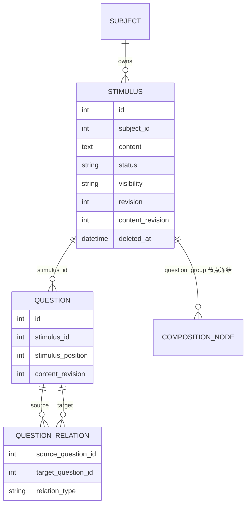

# 文科材料题与题目派生关系设计

> 状态：材料题模型与“选项匹配”复合题前后端均已实现，待浏览器实测与人工审核（见“待完成”）
> 实施分支：`feature/humanities-question-groups`
> 更新日期：2026-09-29

## 背景

原有 `questions.parent_id` 的设计目的是记录 AI 按知识点把一道题拆成多道题的派生关系，它表达“这道题由哪道题拆出”，并不是阅读理解、材料分析题中的“共享材料包含若干小题”。两者领域语义不同：

- AI 拆题中的来源题和派生题都可以独立作答。
- 材料本身不可作答，没有题型、答案或选项。
- 材料题的小题离开材料就无法作答（“根据材料一……”），依赖必须跟随题目本身。
- 删除来源题不应删除派生题。

因此拆分为两个独立领域：

1. `Stimulus`（题目材料）+ `Question.stimulus_id / stimulus_position` 表达材料题。
2. `QuestionRelation` 表达 AI 拆题产生的派生谱系。

### 第一版方案为何被推翻

第一版在题库中建立了 `QuestionGroup + QuestionGroupItem` 实体，题目与材料之间只能经由题组关联，题目与题组多对多。独立审查发现：

- 依赖方向放错：`Question` 自身不知道依赖哪篇材料，小题可以脱离材料单独进入试题篮和稿件。
- 同一小题可属于多个题组、甚至挂在不同材料下，统计口径（得分率、testlet 归属）不唯一。
- 材料、题组、题目三套 status/visibility/revision 互相校验，生命周期复杂。
- `revision` 同时承担乐观锁和内容版本，改材料状态也会让稿件误报过期。

IMS QTI 2.2 的做法是由 item 在自身 itemBody 中引用共享材料，分组属于试卷层 `assessmentSection`。本设计与之对齐：依赖写在题目上，“题组”只存在于稿件中。

## 领域模型

```mermaid
erDiagram
    SUBJECT ||--o{ STIMULUS : owns
    STIMULUS ||--o{ QUESTION : "stimulus_id"
    QUESTION ||--o{ QUESTION_RELATION : source
    QUESTION ||--o{ QUESTION_RELATION : target
    STIMULUS ||--o{ COMPOSITION_NODE : "question_group 节点冻结"

    STIMULUS {
        int id
        int subject_id
        text content
        string status
        string visibility
        int revision
        int content_revision
        datetime deleted_at
    }

    QUESTION {
        int id
        int stimulus_id
        int stimulus_position
        int content_revision
    }

    QUESTION_RELATION {
        int source_question_id
        int target_question_id
        string relation_type
    }
```

### 术语

- 中文界面统一称“题目材料”；代码标识使用 `Stimulus`。
- `Question` 始终是可作答、可评分的题目；材料题的小题使用现有题型。
- 题库中没有“题组”实体。稿件中的 `question_group` 节点表示“一篇材料 + 从中选用的小题”，相当于 QTI 的 section/testlet。

### 约束

- 一道题最多依赖一份材料：`Question.stimulus_id` 可空。
- `UNIQUE(stimulus_id, stimulus_position)`，`stimulus_position >= 0`；软删除的小题 `stimulus_position` 置空，不占位置。
- 材料与小题同学科；公开题目不能挂在私有材料下；材料下有公开小题时不能改为私有。
- 材料下仍有活动小题时不能删除材料。
- `Stimulus.revision` 是乐观锁，任何写入（含状态、小题成员与顺序）都递增；`Stimulus.content_revision` 只在正文变化时递增，供稿件判断材料快照是否过期。
- `QuestionRelation`：禁止自关联、重复边、跨学科边和有向环；删除关系不删除题目。

### 生命周期

- 题目软删除：让出材料内位置，保留 `stimulus_id` 以便恢复，并递增材料乐观锁。
- 题目恢复：追加到材料末尾；材料已删除则转为独立题。
- 改题目学科：若依赖材料，必须与材料学科一致。

## API

| 方法 | 路径 | 用途 |
| --- | --- | --- |
| `POST` | `/subjects/{sid}/stimuli` | 创建材料 |
| `GET` | `/subjects/{sid}/stimuli` | 分页列表，含 `question_count`；支持关键词、状态、可见性、`only_deleted` |
| `GET` | `/subjects/{sid}/stimuli/{id}` | 材料详情，含按顺序排列的可见小题 |
| `PUT` | `/subjects/{sid}/stimuli/{id}` | 更新材料（`expected_revision`） |
| `PUT` | `/subjects/{sid}/stimuli/{id}/questions` | 整体设置有序小题（`expected_revision` + `question_ids`） |
| `DELETE` | `/subjects/{sid}/stimuli/{id}?expected_revision=` | 软删除无活动小题的材料 |
| `POST` | `/subjects/{sid}/stimuli/{id}/restore` | 恢复材料 |
| `GET` | `/questions?has_stimulus=&stimulus_id=` | 按材料归属筛选题目 |
| `GET/POST/DELETE` | `/questions/{id}/relations…` | 派生关系 |
| `POST` | `/questions/{id}/derived-questions` | 原子创建派生题及关系 |

材料小题只有一条写路径：`PUT …/stimuli/{id}/questions`。

- 列表中的题目挂到该材料并按列表顺序重排；未列出的现有小题解除关联，成为独立题。
- 题目已属于其他材料、跨学科、已删除或不可见时拒绝，整次不产生部分修改。
- 操作者看不见的他人私有小题不受本次编辑影响，保持相对顺序排在末尾。
- 普通题目创建/更新契约不接受 `stimulus_id`；前端“在材料下新建小题”= 先建题，再调用该接口挂入。

## 组稿

### 材料题节点（`question_group`）

- 节点字段：`stimulus_id`、`stimulus_revision`（钉住材料 `content_revision`）、`content`（冻结的材料正文）。节点不带 props，分值、题号都在小题节点上。
- 子节点：小题 `question`、紧随小题的作答区 `answer_space`、可锚定到小题前的说明块 `heading/rich_text`。
- 新建节点：客户端提交 `stimulus_id` 和所选小题（至少一题、不可重复、必须当前属于该材料），服务端冻结材料和小题快照，并按材料顺序排序。
- 已有节点：可以删减小题，可以补回同材料的小题（从实时题目冻结），不可重排已保留小题，不可更换材料。
- 根级 `question` 节点新冻结时，若题目依赖材料则拒绝；已冻结的旧节点不追溯，但“同步此题”会拒绝并提示以材料题重新加入。
- 普通保存不回查来源、不改写已冻结内容。

### 过期与刷新

状态接口返回：`stimulus_id`、`stimulus_pinned_revision`、`stimulus_current_revision`、`stimulus_available`、`members[]`、`new_question_ids`、`structure_changed`、`stale`。

`stale` 为真的条件：

- 材料不可用（删除、跨学科、共享稿件中的私有材料）；
- 材料 `content_revision` 变化；
- 已选小题内容变化、不可用或已不属于该材料；
- 已选小题在材料中的相对顺序变化。

材料下新增的小题只进入 `new_question_ids` 作为提示，不算过期；只改材料状态、来源等元数据也不算过期。

整组刷新：刷新材料与已选小题快照，按实时顺序重排，移除已脱离材料的小题及其作答区，保留节点 ID、题号、分值、布局和说明块（锚点失效时顺延到下一道仍存在的小题）。刷新不会自动加入新小题；刷新后无可用小题则拒绝。多个节点一次刷新时稿件 revision 只增加一次，任一失败整体回滚。

### 快照与导出

定稿快照 schema v3 按前序展平保存材料题节点（`stimulus_id`、`stimulus_revision`、`content`）及其子节点。v2 快照不迁移，预览和导出同时支持 v2 与 v3。DOCX/LaTeX 按节点依次渲染材料、小题、题号、分值和作答区；参考答案按文档顺序收集独立题与材料题小题。

### 加入稿件

- 试题篮和“直接加入稿件”：所选题目中依赖同一材料的小题自动合成一个材料题节点；稿件已有同材料节点时并入（去重），否则新建。
- 材料页提供“整组加入稿件”。

## 智能导入

抽取契约保留 `stimuli`、`question_groups`、`question_group_ref`，其中题组只描述原文结构（`temp_id`、`stimulus_temp_id`、`question_temp_ids`、`metadata`），不落独立实体：

- 预检：temp_id 唯一、引用存在、组内至少一题且不重复、**一道题最多属于一个组**、公开题目不挂私有材料、派生关系无自环。
- 写库：成员题目写入 `stimulus_id` 与顺序；同一材料被多个组引用时位置顺延。
- outline 中的 `question_group_ref` 生成材料题节点（材料 + 该组小题）；没有 outline 时在组内首题的位置展开。
- 全程只 `flush`，任一环节失败整次回滚。

## 选项匹配复合题

“多个作答点共享一组选项”的题型，按 QTI 复合题建模为一道题：

- 新题型 `option_matching`（选项匹配）；`options` 列作为共享选项池；题干沿用 `blank` 节点作为作答点。
- 答案：`{kind: "option_matching", slots: [{id: blankId, correct: optionId}], allow_reuse: bool}`。校验：slot id 唯一；题干有 blank 节点时 slots 顺序与之一致；已填的正确项属于选项池；`allow_reuse=false` 时正确项互不相同（由此隐含选项数不少于空位数）；待审/发布时每个空位都必须有答案，草稿可留空。
- 导入：题型标签识别“选项匹配 / 信息匹配 / 匹配题”；答案按空位顺序的选项字母（`CAGDE`）转为 slots `blk_1…`，字母重复时自动 `allow_reuse=true`。
- 默认不配作答区。
- 稿件：每个空位占独立题号和分值，`props.slots = {blankId: {number?, score?}}`；该题型不使用 `props.number/score`。计分点标识为（稿件版本, 节点, 空位）。
  - schema 只校验 `slots` 形状；题型相关规则由 `replace_nodes` 按冻结内容校验：选项匹配题带 `number/score` 或未知 slot 键、其他题型带 `slots` 均拒绝（400）。
  - 单题同步与材料题整组同步后按新快照收敛 props：去掉已不存在的空位；题型改变时丢弃不再适用的 `number/score` 或 `slots`；新增空位不自动编号。
  - 整卷导入生成稿件时每个空位占一个题号（重新编号或原卷题号为数字时顺延）；原卷分值无法可靠拆到空位，不写入。
  - AI 组稿工具不写 `slots`（模型看不到空位 id），工具说明要求选项匹配题不填题号/分值，由用户在画布设置。
- 导出：题干空位内显示对应题号，共享选项池照常列出；分值显示为“每空 N 分”（全部空位同分）或“共 N 分”；答案与参考答案按空位题号逐条列出（`36. C；37. A`），题目本身不再带整题题号。定稿快照原样保存 `props.slots`。
- 前端：
  - 题目编辑：题型“选项匹配”，题干可插入空位，选项池与选择题同样缺省 4 项、按需增减；答案按空位下拉选择，空位随题干增删同步，重复选用需勾选“允许同一选项用于多个空位”。
  - 稿件：自动编号（两种模式）每个空位占一个题号；分数分布与合计按空位展开；题目块内逐空位编辑题号/分值，题干空位显示题号；序列化时只发有效空位的 `slots`。
  - AI 组稿操作对选项匹配题忽略插入时的题号/分值，改属性时返回错误让模型改正；大纲向模型展示空位题号。
  - 定稿预览与导出一致。

## 待完成

### 收尾

- 浏览器实测（2026-09-29）已通过：材料编辑与小题排序、材料题加入稿件、稿件内增删小题与整组同步、选项匹配题的编辑/组稿/编号/赋分/定稿预览/Word 与 LaTeX 导出。未实测：智能导入材料题（需 AI 配置或结构化文档，已由后端与前端单测覆盖）。
- `pnpm generate` 的 4 条 CSS “Lexical error” 警告来自既有的 `components/ui/bubble/index.ts`（CSS 相对颜色语法），与本改动无关。
- 提交与合并前由人工审核。

### 暂不实施（后续版本）

- 材料的标签与知识点。
- 在线作答与计分：按“考试计分与统计的前向约定”落地作答记录。

## 考试计分与统计的前向约定

- 作答记录绑定 `composition_version_id + node_id (+ slot_id)`，不绑定实时题目。
- testlet 标识为材料题节点；由于一题只依赖一份材料，同一题目的得分率上下文唯一。
- 材料曝光可由稿件节点的 `stimulus_id` 统计。

## 迁移

- `9417bea9971b`：建 `stimuli`（含 `content_revision`），`questions` 增加 `stimulus_id/stimulus_position` 及约束，建 `question_relations`（含目标索引），并把合法的历史 `parent_id` 转为 `decomposed_from`。
- `d53ff6ff31fe`：`composition_nodes` 增加 `stimulus_id/stimulus_revision` 及类型约束。
- `b9d5f0a21c3e`：归档历史 `parent_id` 到 `legacy_question_parent_audits` 并删除该列；降级有损。
- `c3f1a9e27b54`：`questions.q_type` 从 MySQL ENUM 改为 `VARCHAR(32)`（ORM 仍返回 `QuestionType`），之后增减题型不再改表。库中存在旧 ENUM 不认识的题型时拒绝降级。
- 以上迁移只在本分支存在，已在 SQLite 与 MySQL 上往返验证。

## 关键实现位置

- 模型：`backend/app/models/stimulus.py`、`question.py`、`question_relation.py`、`composition.py`
- 服务：`backend/app/services/stimulus_service.py`、`question_relation_service.py`、`composition_service.py`、`paper_import_service.py`、`composition_authoring.py`
- API：`backend/app/api/v1/endpoints/stimuli.py`、`questions.py`
- 前端：`frontend/app/components/materials/*`、`lib/materialEditor.ts`、`lib/compositionDocument.ts`（材料题节点、按空位编号计分）、`lib/questionModel.ts`、`components/AnswerEditor.vue`、`components/composition-next/nodes/QuestionGroupBlockView.vue`、`QuestionBlockView.vue`、`lib/importReview.ts`
- 测试：`backend/tests/test_stimulus_questions.py`、`test_composition_question_groups.py`、`test_api_composition_question_group_sync.py`、`test_api_paper_import.py`、`test_migrations.py`、`test_option_matching.py`、`test_option_matching_composition.py`

## 参考

- IMS QTI 2.2 Implementation Guide（3.1 How Big is an Item、3.8.1 Sharing Text between Different Items、4 Tests）：<https://www.imsglobal.org/question/qtiv2p2/imsqti_v2p2_impl.html>
