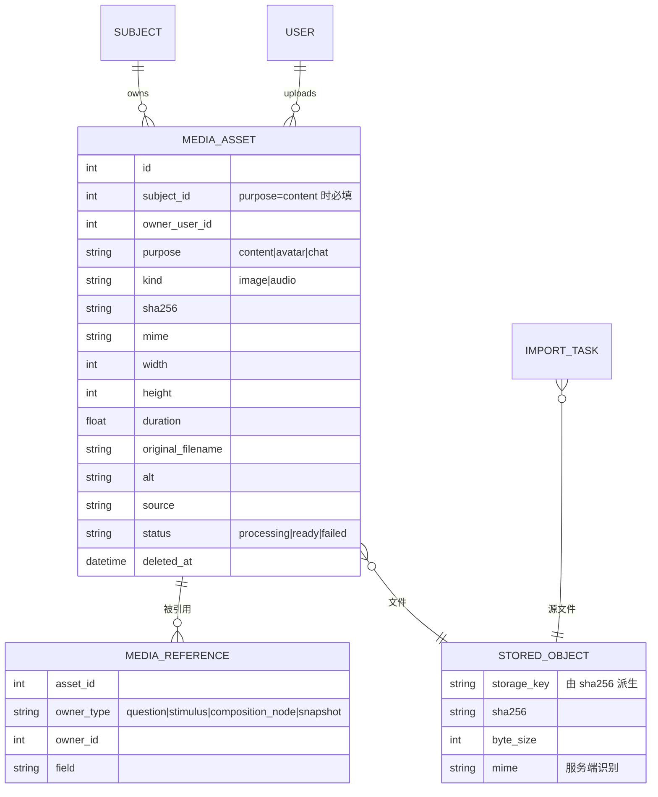

# 媒体资产设计

> 状态：决策已确认（见“决策”）；P0 安全修复已实施，P1 起待实施
> 更新日期：2026-09-30
> 关联：[文科材料题设计](./humanities-question-groups.md)（听力材料题、机考将建立在本设计之上）

## 背景

目前图片等媒体没有数据模型，只是按几种路径约定散落在磁盘上，富文本直接保存 URL。带来的问题：

- **无法复用**：没有 id、没有索引，同一张图只能重复上传。
- **不知道谁在用**：没有引用关系，删除时不知道影响范围，孤儿文件无法清理。
- **URL 与物理路径耦合**：将来切换对象存储/CDN 需要改写全部富文本。
- **没有元数据**：尺寸、alt、来源/版权、校验和都没有。

后续要支持听力题和机考，媒体还必须**不可变**（稿件快照引用永远有效）、**可追踪**、**鉴权下发**（开考前不得泄露）。这些都需要先有统一的媒体资产层。

## 现状盘点

### 需要存储的文件

| 类别 | 来源 | 格式 | 当前位置 / 引用方式 |
| --- | --- | --- | --- |
| 内容媒体 | 编辑器上传、粘贴（`/upload/image`） | 任意 `image/*` | `static/media/images/{uuid}{ext}`；富文本 `src` 存 URL |
| 内容媒体 | docx 导入，pandoc 抽取 | docx 内嵌格式（可能含 EMF/WMF） | `static/media/{task_id}/` |
| 内容媒体 | markdown zip 包 | png/jpg/gif/webp/bmp/svg/tif/tiff | `static/media/{media_id}/…` |
| 内容媒体 | 图片识别原图 | jpg/png 等 | `static/media/{task_id}/uploaded_image.png` |
| 内容媒体（未来） | 听力材料 | mp3/m4a/wav 等 | — |
| 导入源文件 | 同步导入 / 批量导入 | docx、md、zip | `uploads/{session}/原名`，路径写入 `ImportTask.file_path` |
| 用户媒体 | 头像 | 图片 | 复用 `/upload/image`；`users.avatar_url` 存 URL（也允许外链） |
| 用户媒体 | AI 对话附图 | 图片 | 复用 `/upload/image`；`chat_messages.images` 存路径字符串 |
| 表格导入 | 知识点/标签/用户 | xlsx | 内存解析（`pd.read_excel(BytesIO)`），不落盘 |
| 生成产物 | 稿件导出、md→docx | DOCX、LaTeX zip | 临时文件，响应后删除 |
| 生成产物（未来） | 整卷听力音频 | mp3 | — |
| 系统数据 | 桌面版 | SQLite、`config.json`、ChromaDB、日志 | 不属于媒体，由备份/迁移负责 |

注：代码中没有 EMF/WMF 转换逻辑；tif/bmp 大多数浏览器不能显示。

### 导入过程写入的文件与消费方

| 文件 | 位置 | 消费方 | 结论 |
| --- | --- | --- | --- |
| 源文件（同步导入） | `uploads/{session}/原名` | 题目列表“查看源文件”（`/preview` 预览 docx/md）；删除导入任务时删除文件 | 有消费方，功能疑似失效（见下） |
| 源文件（批量导入） | 同上 | worker 异步处理与失败重试；“查看源文件” | 有消费方 |
| 批量导入的 zip 原包 | `uploads/{session}/x.zip` | 无（任务指向解压出的 md，删任务也不删 zip） | 无消费方，永不清理 |
| zip 解压目录 | `uploads/{media_id}/archive/` | 仅解压当时 | 无消费方，永不清理 |
| 中间文件 `content.md` | `uploads/{task_id}/content.md` | docx：pandoc 写出后同一函数内读回；markdown：写出后从不读取 | 无消费方 |
| 抽取出的图片 | `static/media/{task_id 或 media_id}/` | 题目富文本引用 | 真实消费方 |
| 图片识别原图 | `static/media/{task_id}/uploaded_image.png` | 后端返回 `image_url`，前端未使用 | 无消费方 |

**“查看源文件”疑似失效（未实测）：** 前端用 `` `/${file_path}` `` 拼 URL，而 `UPLOAD_DIR` 被锚定到绝对路径的 `DATA_DIR` 下，存下的是绝对路径，拼出 `//home/…` 会被浏览器当作协议相对 URL。可用 `SELECT id, file_path FROM import_tasks ORDER BY id DESC LIMIT 5` 确认；较早的相对路径记录可能仍然可用。zip 源（预览页不支持）和 `"virtual"` 路径也打不开。

### 存储路径现状

| 路径 | 内容 | 目录中的 id |
| --- | --- | --- |
| `uploads/{session}/原名` | 同步/批量导入源文件 | 上传会话 id |
| `uploads/{session}/{media_id}/x.md` | 批量 zip 解出的 md | 会话 id + 媒体 id |
| `uploads/{media_id}/archive/…` | zip 解压目录 | 媒体 id |
| `uploads/{task_id}/content.md` | pandoc 中间文件 | 处理任务 id |
| `static/media/images/{uuid}.ext` | 编辑器图片、头像、对话附图 | 随机 uuid |
| `static/media/{task_id}/…` | docx 抽取图片、识别原图 | 处理任务 id |
| `static/media/{media_id}/包内路径` | zip 内图片 | 媒体 id |
| 系统临时目录 | 稿件导出、md→docx | — |

问题在于目录承担了太多职责：按来源分目录、三种含义不同的 id、用户原文件名直接落盘、URL 即物理路径、临时文件与持久文件混放。结果是同类内容分散在多套结构里，私有与公开文件都在公开静态目录下，并且说不清哪些目录可以清理、桌面版该备份哪些。

### 安全问题（P0，已修复）

| # | 问题 | 位置 |
| --- | --- | --- |
| 1 | `/upload/*` 全部无需登录，匿名可写文件 | `api/v1/endpoints/upload.py`，路由挂载无依赖 |
| 2 | 只校验客户端声明的 `content_type`，扩展名取自原文件名；可上传 html/带脚本 svg，经 `/static/media` 同源下发形成存储型 XSS | `upload.py` `upload_image` |
| 3 | zip 导入白名单包含 `.svg`，同样同源下发 | `services/importing/ingest.py` |
| 4 | 导出解析图片路径时不检查是否位于 `MEDIA_DIR` 内；富文本校验也不检查 `src`，可把服务器任意可读文件嵌入导出的 DOCX | `services/exporting/images.py` |
| 5 | AI 对话按客户端提供的 `images` 路径读文件并 base64 发送给模型服务，可外泄任意可读文件 | `api/v1/endpoints/chat.py` `get_image_base64` |
| 6 | `ImportTask.file_path` 可由客户端指定（整卷导入 `payload.file_path`、`/questions/batch`、`/questions/batch-legacy`），删除导入任务时直接 `unlink()`，可删除服务器任意可写文件（如 SQLite 库、`config.json`） | `api/v1/endpoints/import_tasks.py` `delete_import_task` |
| 7 | `/uploads` 为公开静态目录，导入的原始试卷可被未登录下载 | `main.py` |
| 8 | 服务器绝对路径经题目接口 `import_task.file_path` 返回前端 | `schemas/question.py` |

修复要点：上传接口鉴权与权限校验；服务端按文件头识别类型、由识别结果决定扩展名、禁止 html/svg；限制大小；所有“路径 → 文件”解析都做根目录包含检查；不再接受客户端传入的文件路径（改为服务端签发的 id）；源文件改为鉴权下载。

**P0 实施情况：** 路径包含检查集中在 `app/core/file_paths.py`；`/upload/*` 要求登录；`/upload/image` 用 Pillow 识别格式（PNG/JPEG/GIF/WebP，10 MB 上限）；客户端回传的源文件路径仅在位于 `UPLOAD_DIR` 内时采信，否则记为 `virtual`；`/uploads` 静态挂载已移除，源文件经 `GET /api/v1/imports/{id}/source` 下载（任务所有者、超级管理员，或能看到该任务任一道题的用户）；题目接口只返回 `import_task.has_source`。测试见 `tests/test_file_security.py`。副作用：“查看源文件”按钮恢复可用；它曾因 URL 拼接问题失效，这一点未在浏览器中实测。

## 设计

### 原则

1. **富文本引用资产 id，不引用 URL。** URL 在渲染时由 id 解析，存储后端可替换。
2. **资产不可变。** 文件内容永不修改；替换即新建资产并更新引用。快照引用永远有效。
3. **内容寻址。** 按 sha256 去重；物理存储键由哈希派生，同一文件只存一份。
4. **单一入口。** 所有上传、导入、识别都经 `media_service.ingest`，统一校验、转换、去重。
5. **引用可追踪。** 内容保存时同步维护引用索引，删除与清理都基于索引。
6. **鉴权下发。** 不再公开静态挂载；媒体接口校验登录与权限。
7. **路径按生命周期组织，完全由系统生成。** 见“存储布局”。

### 分类与归属

| 类别 | 存放 | 可见范围 | 进媒体库/可复用 | 保留策略 |
| --- | --- | --- | --- | --- |
| 内容媒体（图片、音频） | `media_assets`，`purpose=content` | 学科 | ✅ | 有引用即保留；被快照引用永久保留 |
| 头像 | `media_assets`，`purpose=avatar`，归属用户 | 公开可读 | ❌ | 随用户 |
| AI 对话附图 | `media_assets`，`purpose=chat`，归属用户 | 仅本人 | ❌ | 随会话 |
| 导入源文件 | 统一底层存储，**不进媒体库**；`ImportTask` 记录存储键 | 导入者与管理员 | ❌ | 随导入的题目长期保留（“原卷对照”） |
| 中间 md、解压目录、zip 原包、识别原图 | **不再落盘**或处理后立即删除 | — | — | — |
| 生成产物 | 默认不存；整卷听力音频按 `(稿件, 版本)` 缓存 | 同稿件 | ❌ | 可随时重建 |
| 系统数据 | 不纳入 | — | — | 备份机制负责 |

### 存储布局

#### 路径原则

1. **按生命周期分根目录，不按来源分。** 持久对象 / 可重建衡生 / 可重建缓存 / 可随时清空的临时区，每个根目录只有一种生命周期。来源、归属、用途全部是数据库元数据。
2. **路径完全由系统生成。** 原文件名、上传会话、学科都不进路径；没有特殊字符、重名和注入问题。
3. **持久文件内容寻址。** 路径由 sha256 推导，相同内容只存一份且不可变；路径是确定的，无需维护路径与文件的对应关系。
4. **路径与 URL 解耦。** 不再把任何存储目录挂成静态目录；公开与私有由数据库和签名决定，不由目录决定。
5. **衍生文件以“源哈希 + 变换规格”为键。** PNG 转换、缩略图、音频转码可随时删除重建。
6. **临时区可随时清空。** 每个处理任务一个工作目录，处理完即删；启动时清理超时残留。
7. **唯一的路径模块。** 业务代码不拼路径；该模块负责生成与解析，并统一做根目录包含检查，从结构上杜绝路径穿越。
8. **原子写入。** 先写临时区、校验哈希，再 `rename` 到目标位置；临时区与存储区须在同一文件系统。
9. **存储键与后端无关。** 本地相对路径即将来 S3/MinIO 的对象键。

#### 目录布局

```text
DATA_DIR/
├── config.json · question_bank.db            # 系统数据（已有）
├── storage/
│   ├── objects/ab/cd/<sha256>                # 所有持久文件：内容媒体、头像、对话附图、导入源文件
│   └── derived/ab/cd/<sha256>/<变换>.<ext>   # PNG 衍生、缩略图、音频转码
├── cache/                                    # 可重建缓存，如整卷听力音频（按稿件+版本）
├── tmp/jobs/<job_id>/                        # pandoc 抽取、zip 解压、导出渲染；任务结束即删
├── vector/                                   # ChromaDB
└── logs/
```

- `objects/` 下文件**不带扩展名**，类型以数据库 `mime` 为准，客户端无法伪造扩展名。LaTeX 导出等需要扩展名的场景由路径模块按 `mime` 补上。
- 导入源文件也进 `objects/`：重复上传自动去重，与现有 `ImportTask.content_sha256` 重复导入提示一致。
- 桌面版备份只需数据库 + `storage/objects/`；`derived/`、`cache/`、`tmp/` 均可重建。
- 一个对象只有在没有任何资产记录、导入任务、快照引用它时，才由回收任务删除。

#### 新旧对照

| 现在 | 以后 |
| --- | --- |
| `uploads/{session}/原名`（源文件） | `objects/…`；`ImportTask` 记录存储键与原文件名 |
| `uploads/{session}/{media_id}/x.md`、`uploads/{media_id}/archive/`、`uploads/{task_id}/content.md` | `tmp/jobs/<job_id>/`，处理后删除 |
| `static/media/images/*`、`static/media/{task_id 或 media_id}/*` | `objects/…` + `media_assets` 记录 |
| 图片识别原图 | 不再保存（如需原图对照，作为导入任务附件进 `objects/`） |
| 系统临时目录（导出、md→docx） | `tmp/jobs/<job_id>/` |

### 数据模型



- `STORED_OBJECT` 是存储抽象层的概念（本地磁盘 / MinIO / S3），不一定建表；`storage_key` 形如 `ab/cd/<sha256>`（无扩展名，见“存储布局”）。
- `media_assets` 唯一约束：`(subject_id, sha256, purpose)`。跨学科复用同一文件会新建逻辑资产，物理文件共享。
- 衍生文件（EMF/WMF/TIFF→PNG、音频转码结果）作为资产的派生版本存储，原件保留以便重新转换。

### 富文本引用

```jsonc
// 图片节点
{ "type": "image", "attrs": { "assetId": 42, "width": 320, "align": "center", "alt": "…" } }
```

- `src` 仅保留给外链与迁移期旧数据。
- 后端校验：`assetId` 必须存在且对当前内容的学科可见；`src` 只允许 http(s) 外链或受控前缀。

### 统一入口 `media_service`

`ingest(data | path, filename, purpose, subject, actor) -> MediaAsset`：

1. 按文件头识别类型，白名单放行：图片 png/jpeg/gif/webp；svg 默认不开放；音频在听力阶段开放。
2. 大小限制；计算 sha256；同范围内已存在则直接返回（复用）。
3. 读取尺寸/时长；EMF/WMF/TIFF/BMP 生成 PNG 衍生文件。
4. 音频交给 `app/worker.py` 异步转码与响度归一（EBU R128），期间 `status=processing`。

调用方：编辑器上传/粘贴/拖入、docx/pandoc 导入、zip 导入、图片识别、头像、对话附图。现有 3～4 套路径约定全部移除。

### 引用索引 `media_references`

- 题目、材料、稿件节点的写路径在同一事务内扫描富文本并更新索引。
- 快照创建时登记 `owner_type=snapshot`，被快照引用的资产永不回收。
- 用途：媒体库“被 N 道题使用”、安全删除、孤儿回收、将来 QTI 内容包的文件依赖清单（QTI 3 采用 IMS Content Packaging）。

### 下发：复用登录 cookie

前端把登录 token 存在 `token` cookie 中（`plugins/api.ts` 再把它放进 `Authorization` 头）。同源的 ``/`<audio>` 请求会自动携带该 cookie，因此媒体接口同时接受 `Authorization` 头或 `token` cookie，无需签名 URL：

- 资产 URL 固定为 `/api/v1/media/{id}/content`；内容不可变，响应 `Cache-Control: private, max-age=31536000, immutable`。
- 权限：内容媒体需要该学科 `VIEW_QUESTION`；头像任意登录用户；对话附图仅本人。
- 签名 URL（HMAC + 过期时间）推迟到机考阶段，用于按考试时段限制访问或接 CDN。
- `token` cookie 前端可读（非 httpOnly）是既有风险，不在本设计范围内。
- 响应头：服务端识别的 `Content-Type`、`X-Content-Type-Options: nosniff`，必要时 `Content-Disposition`。
- 导入源文件通过鉴权接口 `GET /api/v1/imports/{id}/source` 下载，前端只传任务 id（P0 已实施）。

### 导出

`ImageResolver` 改为按 `assetId → storage_key` 定位文件，不再解析 URL；保留旧 `src` 兼容路径，并加根目录包含检查。

### 前端：插入选择器与媒体库

复用主要发生在编辑器里，因此分两个界面，按顺序实施：编辑器“插入媒体”选择器（优先）和独立的“媒体库”管理页（整理、查用途、清理、替换）。

#### 用户与场景

| 角色 | 场景 | 需要的能力 |
| --- | --- | --- |
| 出题老师 | 出新题时复用以前的图 | 在编辑器里搜到并插入 |
| 出题老师 | 发现图有错 | 替换，并看清影响范围 |
| 学科负责人 | 整理素材，补来源与版权 | 浏览、批量编辑元数据 |
| 学科负责人 / 管理员 | 清理磁盘 | 找出未使用的资产并批量删除 |
| 管理员（桌面版尤甚） | 了解数据量与备份范围 | 存储占用统计 |

#### 范围

| 阶段 | 内容 |
| --- | --- |
| MVP | 编辑器选择器（上传 / 媒体库 / 最近使用）；媒体库页：网格浏览、搜索筛选、详情与“被引用于”、删除未使用资产 |
| 第二步 | 替换（选择影响范围）、批量操作、编辑来源/版权/alt、跨学科加入 |
| 随听力 | 音频播放、时长、转码状态、切片标注 |
| 暂不做 | 在线图片编辑（裁剪、标注）；本质是生成新资产，以后再考虑 |

衡量指标：插入时来自媒体库的比例与上传去重命中率；未使用资产占比与占用空间；缺 alt 的图片占比。

风险：迁移前上线会是空库（需在 P3 之后上线，或附带“扫描旧图片”）；“替换”影响面大，必须展示范围并说明已冻结稿件不受影响；权限与题目一致，只读成员不能删除/替换，头像与对话附图不进媒体库。

#### 入口

侧边栏“知识库”分组新增“媒体库”，与知识点管理、标签管理并列（都是学科内可复用资源）。不作为题库的第三个页签，因为媒体不是题。

#### 媒体库列表

默认网格（缩略图），可切换列表视图。

```text
┌ 媒体库 ──────────────────────────────── [上传] ┐
│ 🔍 搜索文件名/来源/alt  类型▾  使用情况▾  上传者▾  排序▾  ⊞ ☰ │
├───────────────────────────────────────────────┤
│ ┌─────┐ ┌─────┐ ┌─────┐ ┌─────┐ ┌─────┐       │
│ │ 缩略 │ │ 缩略 │ │ 缩略 │ │ 🎵  │ │ 缩略 │       │
│ │ 图   │ │ 图   │ │ 图   │ │ 0:45│ │ 图   │       │
│ └─────┘ └─────┘ └─────┘ └─────┘ └─────┘       │
│ 地图1.png 装置.jpg  图3.emf  Text1.mp3 表格.png │
│ 3 处使用  未使用    ⚠已转换   2 处使用 ⚠缺alt    │
└───────────────────────────────────────────────┘
```

- 卡片：缩略图（音频为图标 + 时长）、名称、使用情况（`未使用` 弱化显示，`N 处使用` 正常显示）、状态提示（`已转换`、`缺 alt`、`处理中`、`处理失败`，有才显示）；悬停显示勾选框、预览与“⋯”菜单。
- 列表视图列：缩略图、名称、类型/格式、尺寸或时长、大小、使用次数、上传者、上传时间。
- 筛选：类型（图片/音频）、使用情况（全部/已使用/未使用）、来源（手动上传/导入）、上传者、有提示。排序：最近上传、最近使用、大小、使用次数。

#### 详情抽屉

点击卡片从右侧打开抽屉（复用 Sheet 组件），列表保持不动，可连续查看。内容：大图预览或音频播放器；可编辑的名称、alt、来源/版权；格式、尺寸、大小、上传者与时间；“被引用于”列表（按题目/材料题/稿件分组、可跳转、稿件标注是否已冻结）；下载、替换、删除按钮。

#### 操作

| 操作 | 入口 | 要点 |
| --- | --- | --- |
| 上传 | 顶部按钮、拖入页面 | 可多选；命中去重提示“已存在，已复用”；只接受白名单格式 |
| 预览 | 悬停按钮、详情 | 图片放大；音频播放 |
| 编辑元数据 | 详情、批量 | 名称、alt、来源/版权；只改元数据，不改文件 |
| 查看被引用于 | 详情 | 按类型分组、可跳转 |
| 替换 | 详情 | 上传新文件后选择影响范围（全部引用 / 勾选部分）；明确提示已冻结稿件版本不受影响；实现为新建资产并改写引用 |
| 删除 | 详情、批量 | 未使用的直接删除（软删除）；已使用的不允许删除，显示引用列表并引导替换或移除引用 |
| 批量操作 | 勾选后底部操作栏 | 删除未使用、批量编辑来源、下载 |
| 下载原件 | 详情 | 原件与转换后的 PNG 都可下载 |
| 加入其他学科 | 详情 | 取决于决策 A；只新建逻辑记录，文件不复制 |

不提供“复制链接”：媒体 URL 需要登录态才能访问，复制给他人也打不开，反而误导。

#### 编辑器“插入媒体”选择器

```text
┌ 插入图片 ─────────────────────────────┐
│ [上传]  [媒体库]  [最近使用]               │
│ 🔍 搜索…            只看未使用 □         │
│ ┌───┐ ┌───┐ ┌───┐ ┌───┐                 │
│ │   │ │ ✓ │ │   │ │   │  ← 已在本题使用 ✓    │
│ └───┘ └───┘ └───┘ └───┘                 │
│ alt [建议填写]           [插入]          │
└─────────────────────────────────────┘
```

- 默认当前学科；“最近使用”指当前用户最近插入过的资产。
- 粘贴、拖入图片仍直接上传并插入，不打断编辑；命中去重时静默复用。
- 插入时提示补充 alt，不强制。
- 编辑器中选中图片时，提供“在媒体库中查看”和“替换这张图”（只影响本题）。

#### 状态与边界

| 情况 | 表现 |
| --- | --- |
| 空库 | 说明用途并提供上传；旧数据未迁移时提示“导入旧图片” |
| 搜索无结果 | 提供“清除筛选” |
| 音频处理中 / 失败 | 卡片显示进度，或失败原因 + “重试” |
| 只读成员 | 隐藏上传、编辑、删除、替换 |
| 已删除但仍被快照引用 | 不出现在列表；稿件导出照常可用 |

无障碍：卡片可键盘选中和操作，勾选框有文字标签；缩略图 alt 用资产 alt，缺省时用文件名；音频播放器可键盘控制。

### 与听力、机考的衔接

媒体层为以下能力提供基础，具体设计另行成文：

- **听力材料题**：`Stimulus.listening` 结构化字段，而不是富文本节点，因为作答端必须确定性地找到它并执行播放策略（对应 QTI `mediaInteraction`）：

  ```jsonc
  {
    "clips": [{ "asset_id": 42, "start": 12.0, "end": 58.5 }],  // 支持整段录音切片
    "play_policy": { "max_plays": 2, "min_plays": 0, "autostart": true, "seekable": false }
  }
  ```

  普通的“内容性”音频（如听音选图的选项）仍可作为富文本节点（对应 QTI `object`）。
- **听力原文**：`Stimulus.transcript`，默认对考生不可见，可见性借鉴 QTI `view`（为无障碍便利预留）。
- **整卷音频**：由稿件快照派生的时间线渲染，属于生成产物，不写回题库。
- 稿件需要“分节容器”承载导航方式、时限、听力参数；当前“大题”只是 `heading` 节点。

## 迁移

1. 扫描所有富文本字段（题目 content/options/answer/thinking/analysis/summary、材料 content、稿件节点），对 `/static/media/...` 引用按 sha256 把文件搬进 `storage/objects/` 并建资产，给节点补 `assetId`，保留原 `src`。
2. 建 `legacy_paths(old_path → sha256)` 对照表。快照不改写，只登记引用；快照中的旧 `src` 经对照表解析到新对象，因此旧目录可以整体删除。
3. `users.avatar_url`、`chat_messages.images` 中的本地路径转为资产。
4. `ImportTask.file_path` 改为存储键，源文件搬进 `objects/`；无法定位的记录与缺失文件输出报告。
5. 删除旧目录 `uploads/`、`static/media/`（含 zip 原包、解压目录、`content.md`、无引用的识别原图），前提是上述报告已确认。

## 分阶段计划

| 阶段 | 内容 |
| --- | --- |
| P0 安全修复 | 上表 8 项；与重构解耦，优先执行（已完成） |
| P1 资产模型 | 存储布局与唯一路径模块（objects/derived/cache/tmp）、原子写入；`media_assets`、`media_service.ingest`、上传与签名下发接口；编辑器写 `assetId`；所有导入入口改走统一入口，工作文件进 `tmp/jobs/` 并在任务结束后删除 |
| P2a 引用与选择器 | `media_references`；编辑器“插入媒体”选择器（上传 / 媒体库 / 最近使用）；源文件鉴权下载 |
| P2b 媒体库页面 | 网格/列表浏览、搜索筛选、详情抽屉与“被引用于”、删除未使用；之后加替换、批量操作、元数据编辑。应在 P3 迁移后上线 |
| P3 迁移与回收 | 旧文件搬进 `objects/`、回填 `assetId`、`legacy_paths` 对照表；孤儿回收任务；删除旧目录 |
| P4 音频 | `kind=audio`、转码 worker、播放组件；之后进入听力材料题 |

## 决策

已于 2026-09-30 确认。

| # | 问题 | 结论 |
| --- | --- | --- |
| A | 资产归属：按学科隔离，还是全局媒体库 | 按学科（与题目权限一致）；跨学科“加入本学科”新建逻辑资产，物理共享 |
| B | 复用语义：引用同一资产，还是复制 | 引用（资产不可变，共享安全） |
| C | SVG | 暂不开放；确有需要再做服务端清洗 |
| D | 存储后端 | 先本地磁盘，抽象成接口，后续接 MinIO/S3 |
| E | 入库转换：EMF/WMF/TIFF/BMP | P1 不转换；仅导入来源允许入库，标记 `displayable=false`，界面提示“浏览器无法显示”。转换（需外部工具）以后单独做 |
| F | 导入源文件保留期限 | 随导入的题目长期保留（“查看源文件”是现有功能）；删除导入任务且无题目引用时清理 |
| G | zip 导入的“查看源文件”展示什么 | 预览页只支持 docx/md，其余格式提供下载 |
| H | “替换”的默认影响范围 | 默认“全部引用”但需用户确认；已冻结稿件永远不受影响 |
| I | 媒体访问鉴权 | 复用登录 `token` cookie（见“下发”）；签名 URL 推迟到机考阶段 |

## 附：QTI 对照

| 本设计 | QTI 对应 | 说明 |
| --- | --- | --- |
| 富文本图片/普通音频节点 | `object`（`data` URI + `type` MIME） | 内容性媒体 |
| `Stimulus.listening` + `play_policy` | `mediaInteraction`（`autostart`、`minPlays`、`maxPlays`、`loop`） | 受控播放；QTI 以整数响应变量记录播放次数 |
| `Stimulus.transcript` 可见性 | `view`（author/candidate/proctor/scorer/testConstructor/tutor） | 按角色可见 |
| `media_references` | 内容包 manifest 的文件依赖 | 导出 QTI 包时生成 |

以上 QTI 条目依据 QTI 2.1 信息模型核实；QTI 3.0 的共享刺激（assessmentStimulus）未能从官方页面核实。
