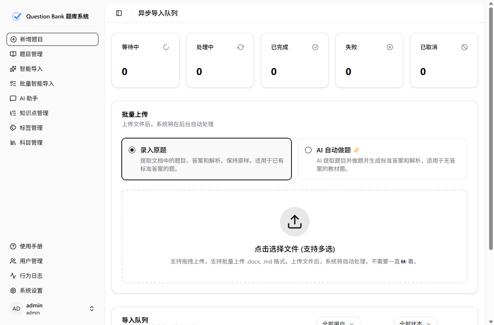

# 产品简介

**Question Bank（题库系统）** 是一个 AI 原生的题库管理系统，面向教研团队、教师与培训机构等，帮助你把散落在 Word、Markdown、图片中的题目，快速抽取成结构化、可检索、可组卷的题库。

## 核心特性

- **多格式智能导入**：上传 Word / Markdown / 图片，AI 自动抽取结构化题目（上传 → 审核 → 入库三步流程）。
- **多题型支持**：单选、多选、填空（支持多解）、判断、解答题；富文本 + LaTeX 公式。
- **AI 多供应商**：Gemini、OpenAI 及所有 OpenAI 兼容 API（DeepSeek、通义、私有部署等），配置存于数据库、可热切换。
- **知识点 RAG**:ChromaDB 向量检索 + 批量重排序，把 AI 推荐的知识点映射到标准体系。
- **审核工作流**：草稿 → 待审 → 发布 → 归档，含审核日志、软删除、批量操作。
- **组卷 / 试题篮**：跨条件筛选、临时收藏、导出 Word / LaTeX。

## 界面总览

## 版本形态

Question Bank 提供两种部署形态，请先阅读 [版本与选型](/guide/editions) 选择适合你的方式：

- **桌面版**（Windows 托盘应用）：开箱即用，适合个人或小团队；可在托盘一键开启[局域网共享](/desktop/lan-sharing)。
- **服务器版**（Docker Compose）：部署在服务器上，使用 MySQL，适合团队与生产环境。

## 下一步

- 不确定用哪个版本 → [版本与选型](/guide/editions)
- 直接安装桌面版 → [安装与首次启动](/desktop/install)
- 部署服务器版 → [Docker Compose 部署](/server/docker)
- 逐个了解功能 → [功能手册](/features/import)
