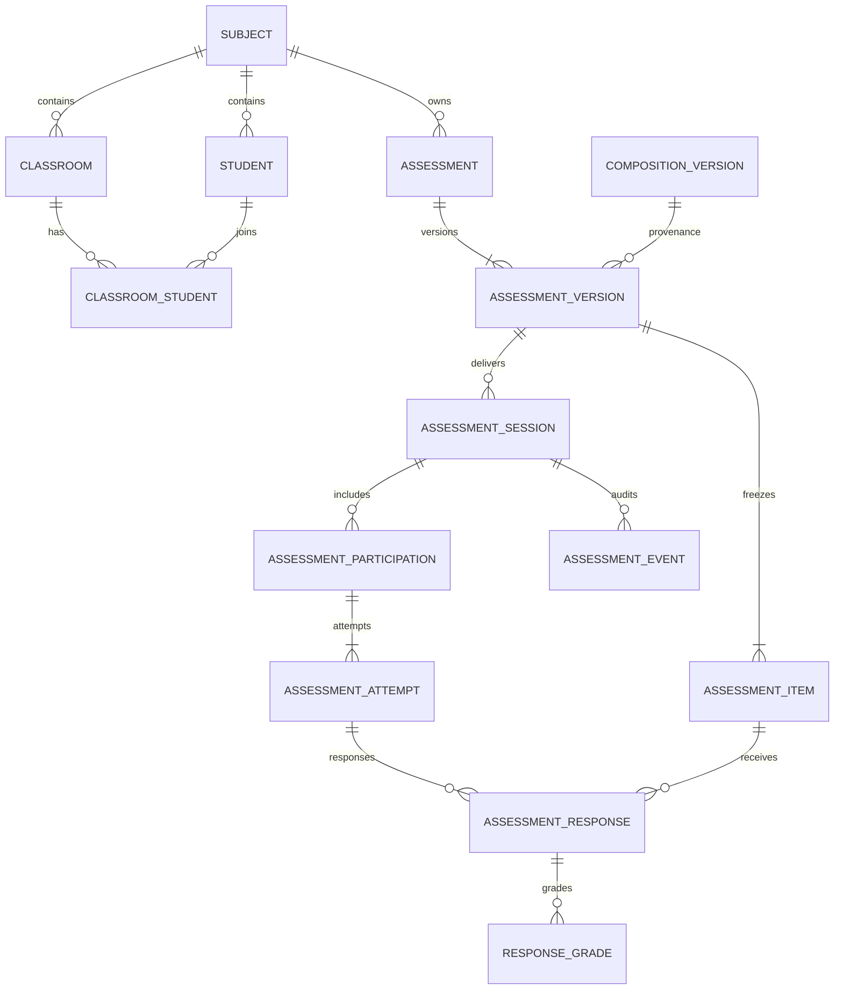

# 通用评测架构交接

> 状态：教师侧线下评测闭环已实现，在线作答仅完成数据基础
> 更新日期：2026-09-15
> 迁移：`6f2d70c895a4`，父版本 `d4e5f6a7b8c9`

## 1. 范围

当前版本支持：

- 管理学科内的学生档案、班级和班级成员。
- 从 `shared` 且启用赋分的 `CompositionVersion` 创建评测。
- 冻结题目、分值、来源修订和参与者身份。
- 教师逐题录分，保留每次改分历史。
- Excel v2 导出、预检和原子导入。
- 按题统计平均分、满分人数、零分人数和失分率。
- 基于 subject 的权限、乐观锁、幂等与事件审计。

当前不提供学生在线答题、自动判分、成绩发布、排名和跨场次趋势分析。相关数据结构已经预留，但没有对外 API 或 UI。

## 2. 领域边界



### 2.1 定义层

- `Assessment` 是可编辑身份，只保存学科、标题、描述、状态、revision 和审计字段。
- `AssessmentVersion` 是不可变版本，`(assessment_id, version_no)` 唯一。当前版本按最大 `version_no` 查询，不保存循环 `current_version_id`。
- `AssessmentItem` 是版本中的冻结条目，保存题面、作答规格、私有评分规格、满分及来源信息。
- `composition_version_id`、`source_question_id` 和 `source_question_revision` 仅用于追溯与统计；运行时呈现和评分不依赖可变的来源记录。

`prompt_snapshot` 是可呈现题面，`scoring_spec` 是私有评分材料。普通响应 DTO 不得返回 `scoring_spec`。

### 2.2 投放与参与

- `AssessmentSession` 表示某个不可变版本的一次投放。
- `AssessmentParticipation` 冻结参与者名称和标识，学生或用户记录删除后使用 `SET NULL`，历史快照仍保留。
- 班级只是创建参与者快照的来源，Session 不保存 `classroom_id`，之后修改班级不会改变历史场次。

Session 使用两个正交状态：

| 维度 | 字段 | 取值 | 线下默认 |
|---|---|---|---|
| 投放 | `delivery_status` | `draft/open/closed` | `closed` |
| 评分 | `grading_status` | `not_started/in_progress/finalized` | `not_started` |

`not_started → in_progress` 开始评分；所有应评参与者完整评分后才能 `in_progress → finalized`。定稿后所有录分和 Excel 导入均返回 `409`。

### 2.3 作答与评分

- `AssessmentAttempt` 表示一次作答或线下录分载体，仅通过 Participation 推导 Session，不冗余 `session_id`。
- `AssessmentResponse` 表示 Attempt 对一个 Item 的响应。线下录分会懒创建答案为空的 Response。
- `ResponseGrade` 是追加式评分账本。改分只新增 revision，不覆盖历史记录。
- 当前成绩定义为 Response 下 revision 最大的 Grade。
- Attempt revision 是成绩行的 CAS 乐观锁；总分和完成度是可重建缓存。

默认 outcome 规则：满分为 `correct`，零分为 `incorrect`，中间分为 `partial`，未评分为 `unscored`。

Response 与 Item 必须属于同一评测版本。该跨表不变量由唯一写入路径 `assessment_service` 校验，不通过冗余 version 字段构造复杂复合外键。数据库负责单表内的闭集状态、非空、分值上下界、revision 和唯一约束。

## 3. 快照创建

`POST /assessments` 在一个事务中完成：

1. 验证组稿版本属于当前学科、scope 为 `shared` 且已启用赋分。
2. 创建 `Assessment` 和不可变 v1。
3. 从 snapshot v2 提取题目，分别冻结公开题面和私有评分规格。
4. 创建线下 `AssessmentSession`。
5. 从班级冻结 Participations，并为每人创建一个 offline Attempt。
6. 写入 `AssessmentEvent`。

任一步失败都会回滚。后续修改题库、组稿、学生或班级不会改变已创建的评测事实。

## 4. 统计口径

条目统计只使用每个 Response 的当前有效 Grade，排除缺考、请假、退出和未评分数据。

- `graded_count`：该条目进入分母的评分数。
- `average_score`：平均得分。
- `full_marks_count`：满分人数。
- `incorrect_count`：零分人数。
- `error_rate`：未获满分人数占已评分人数的比例，即失分率，不等同于客观题答错率。

$$
error\_rate = \frac{graded\_count - full\_marks\_count}{graded\_count}
$$

未来有在线答案事实后，可以另增客观题正确率，不改变现有评分统计。

## 5. Excel v2

工作簿包含可见的 `成绩录入` 表和隐藏的 `_meta` 表。元数据格式为 `question-bank-assessment-gradebook`，版本为 `2`，保存 Session、Item、Participation、Attempt 和 Attempt revision 的结构化 ID。

解析不根据姓名或标题反向识别资源。Preview 验证模板版本、场次、条目、Attempt、revision、分值范围和精度，不写数据库。Apply 在一个事务内追加 imported Grade；任何一行非法则整批拒绝。

导入幂等键绑定 `session + batch_id + file SHA-256`：同文件重放返回已有结果，不重复写入；不同文件复用 batch ID 返回 `409`。

## 6. 权限

| 权限 | 用途 |
|---|---|
| `VIEW_ASSESSMENT` | 查看名册、评测、场次、成绩册和统计；导出 Excel |
| `MANAGE_ASSESSMENT` | 创建学生、班级、修改成员；从组稿创建评测 |
| `EDIT_SCORE` | 开始和定稿评分；逐题录分；Excel 预检与应用 |

所有资源按 `subject_id` 强隔离。资源不存在或不属于路径学科时返回 `404`，权限不足返回 `403`。

## 7. API

所有路径以 `/api/v1/subjects/{subject_id}` 开头。

| 方法 | 相对路径 | 权限 |
|---|---|---|
| `GET/POST` | `/students` | VIEW / MANAGE |
| `GET/POST` | `/classrooms` | VIEW / MANAGE |
| `GET/PUT` | `/classrooms/{id}/students` | VIEW / MANAGE |
| `GET/POST` | `/assessments` | VIEW / MANAGE |
| `GET` | `/assessments/{id}` | VIEW |
| `GET` | `/assessment-sessions` | VIEW |
| `GET` | `/assessment-sessions/{id}` | VIEW |
| `POST` | `/assessment-sessions/{id}/grading/start` | EDIT_SCORE |
| `POST` | `/assessment-sessions/{id}/grading/finalize` | EDIT_SCORE |
| `GET` | `/assessment-sessions/{id}/gradebook` | VIEW |
| `GET` | `/assessment-sessions/{id}/item-statistics` | VIEW |
| `PATCH` | `/assessment-attempts/{id}/grades` | EDIT_SCORE |
| `GET` | `/assessment-sessions/{id}/gradebook.xlsx` | VIEW |
| `POST` | `/assessment-sessions/{id}/grade-imports/preview` | EDIT_SCORE |
| `POST` | `/assessment-sessions/{id}/grade-imports/apply` | EDIT_SCORE |

## 8. 前端

- `/assessments`：按评分状态、评测来源和名称筛选场次，并从组稿定稿版本创建评测。
- `/assessments/sessions/{id}`：概览、分页成绩册、题目统计和 Excel 工作流。
- `/rosters`：学生、班级和成员管理。
- 组稿版本预览页的“创建评测”会跳转到 `/assessments` 并预填版本。

成绩册使用行级草稿，只提交变化条目。revision 冲突后刷新当前页。缺考、请假、退出及 finalized 状态均只读。页面使用 `onActivated` 刷新，以适配全局 `NuxtPage keepalive`。

## 9. 代码位置

### 后端

- `backend/app/models/assessment.py`
- `backend/app/schemas/assessment.py`
- `backend/app/crud/crud_assessment.py`
- `backend/app/services/assessment_service.py`
- `backend/app/services/assessment_excel.py`
- `backend/app/capabilities/assessments.py`
- `backend/app/api/v1/endpoints/assessments.py`
- `backend/alembic/versions/6f2d70c895a4_assessment_domain_tables.py`

### 前端

- `frontend/app/types/assessment.ts`
- `frontend/app/lib/assessments.ts`
- `frontend/app/composables/useAssessments.ts`
- `frontend/app/pages/assessments/index.vue`
- `frontend/app/pages/assessments/sessions/[id].vue`
- `frontend/app/pages/rosters/index.vue`

### 测试

- `backend/tests/test_assessment_models.py`
- `backend/tests/test_api_assessment_core.py`
- `backend/tests/test_api_assessment_excel.py`
- `frontend/app/lib/__tests__/assessments.test.ts`
- `frontend/app/composables/__tests__/useAssessments.test.ts`

## 10. 验证

```bash
cd backend
uv run python -m pytest -q

cd ../frontend
pnpm vitest run
pnpm generate
```

迁移应在隔离数据库执行：

```bash
cd backend
DATABASE_URL='sqlite+aiosqlite:////tmp/question-bank-assessment.db' \
  uv run alembic upgrade head
DATABASE_URL='sqlite+aiosqlite:////tmp/question-bank-assessment.db' \
  uv run alembic check
```

真实 MySQL 验证需要设置 `MYSQL_TEST_URL` 指向可清理的测试库，禁止使用开发或生产数据库。

## 11. 已知限制

- 在线 Attempt/Response API 和学生端 UI 未开放。
- 自动评分、rubric UI、跨场次统计和评分重开未实现。
- 创建来源 UI 当前仅支持 CompositionVersion。
- Session 不保存班级关联；班级仅用于创建参与者快照。
- Assessment 的编辑、归档和审计时间线 UI 尚未开放。
- 未配置 `MYSQL_TEST_URL` 时，真实 MySQL 迁移测试会跳过。

## 12. 手工验收

1. 在 `/rosters` 创建学生、班级并设置成员。
2. 在共享组稿启用赋分并创建定稿版本。
3. 从版本预览页进入 `/assessments`，选择班级并创建评测。
4. 开始评分，逐题保存；使用旧 revision 提交应返回冲突并刷新。
5. 导出 Excel，修改后预检并应用；相同 batch 和文件重放不得重复写入。
6. 检查题目统计分母、满分人数、零分人数和失分率。
7. 所有应评参与者完成后定稿；确认定稿后页面和 API 均只读。
8. 修改来源题目、组稿和班级，确认历史评测内容与参与者不变。