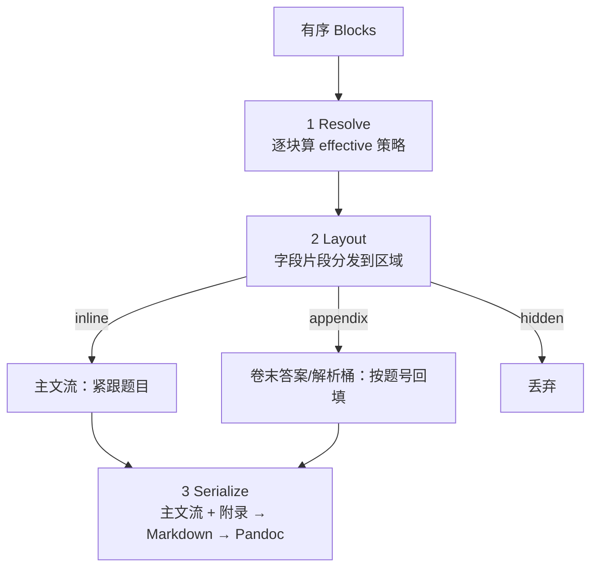

# 架构与 UI 设计：组稿内容显示策略（DisplayPolicy）

> 关联 PRD：[组稿分类去枚举化与模板/克隆机制](./composition-templates-and-cloning.md) §4.6（导出所见即所得）。
> 本文是该条目的架构决策记录（ADR）+ UI 设计，聚焦「答案/分析/解析等内容如何呈现」这一横切能力。

## 1. 背景与问题

一份组稿里的题目，除题干外还有**答案、分析、解析、总结、来源**等附属内容。教师需要：

1. **文档级统一设置**：整份文档默认哪些字段显示、分别显示在什么位置（题后 / 卷末 / 不显示）。
2. **题目级覆盖**：文档里可能夹着「例题」，需要**单独**内联显示答案与分析，而其余练习题保持隐藏。

现状把「是否显示答案」耦合在 `comp_type`（题组默认显示、试卷默认隐藏）里，且导出时才临时勾选包含项 —— 既不是所见即所得，也无法表达题目级差异。

核心结论：**把「题目内容」与「内容在某份组稿里的呈现方式」彻底解耦**，并让呈现策略支持**级联（文档默认 ← 题目覆盖）**。

## 2. 领域分层

| 层 | 职责 | 存储 | 是否复制内容 |
|---|---|---|---|
| **Item（题目）** | 权威内容：题干/选项/答案/分析/解析/总结/来源 | `questions` | 引用，永不复制 |
| **Block（编排块）** | 题目在本文档的位置 + 呈现意图 | `composition_blocks.content` | 随文档 |
| **DisplayPolicy（显示策略）** | 每个字段「显示在哪」 | 内嵌 JSON | — |
| **文档默认策略** | 全文默认 | `compositions.meta_data.display` | 随文档/模板深拷贝 |
| **导出 Profile（预留）** | 面向受众的整体变换（学生版/教师版） | 导出时传入，不落库 | — |

**不变量**：答案永远是引用（改题库答案，所有引用处自动更新）；组稿只存「策略」不存内容副本 —— 这是题库数据一致性的硬要求。

## 3. 值对象：DisplayPolicy

一个字段一条规则，`region` 决定落位：

```jsonc
// 文档级默认：compositions.meta_data.display
{
  "v": 1,                                  // 版本号，前向兼容占位
  "fields": {
    "answer":      { "region": "inline"   },   // 答案
    "analysis":    { "region": "appendix" },   // 分析  -> questions.thinking
    "explanation": { "region": "appendix" },   // 解析  -> questions.analysis
    "summary":     { "region": "hidden"   },   // 总结  -> questions.summary
    "source":      { "region": "hidden"   }    // 来源  -> questions.source
  }
}
```

```jsonc
// 题目级覆盖：composition_blocks.content.display（只存被改字段）
{
  "score": 5,
  "display": { "fields": { "answer": { "region": "inline" }, "analysis": { "region": "inline" } } }
}
```

- `region ∈ { inline, appendix, hidden }`，**开放枚举**：将来可加 `margin`（页边）、`separate_booklet`（答案分册）、`collapsible`（折叠卡）而无需数据库迁移。
  - `inline`：主文流，紧跟题目（= 编辑器所见位置）
  - `appendix`：卷末统一「参考答案与解析」区，按题号回填
  - `hidden`：不导出
- 字段与 `questions` 列的映射见 §6 字段注册表。

## 4. 级联解析（Cascade）

有效策略 = 逐字段按优先级合并，语义类似 CSS 层叠：

```
系统模板默认  ⊂  文档 meta_data.display  ⊂  题块 content.display  ⊂  (导出 Profile 变换)
    低                                                                        高
```

逐字段解析：

```
effective(block, field).region =
    block.display.fields[field]?.region
    ?? document.display.fields[field]?.region
    ?? systemDefault.fields[field].region
然后套用导出 Profile 的变换（本期为 identity）
```


**诉求映射（皆为纯数据、无特例）**：
- 文档统一设置 → 写 `meta_data.display`。
- 例题单独显示答案+分析 → 该题块写局部覆盖；"标为例题"只是写入这段预设的语法糖，底层无「例题」硬编码角色。

## 5. 渲染管线（三趟）

取代现有 `after_question / end_of_paper / hidden` 三分支：



`appendix` 桶可按字段再分小节（全卷答案区 / 全卷解析区），符合试卷「答案统一卷末」的排法。

## 6. 字段能力注册表（Field Registry）

后端集中登记「可显示字段 → 取值来源 + 标签」，新增字段只改一处：

| field key | 来源列 | 导出标签 | 编辑器标签 |
|---|---|---|---|
| `answer` | `questions.answer` | 【答案】 | 答案 |
| `analysis` | `questions.thinking` | 【分析】 | 分析 |
| `explanation` | `questions.analysis` | 【解析】 | 解析 |
| `summary` | `questions.summary` | 【总结】 | 总结 |
| `source` | `questions.source` | 【来源】 | 来源 |

> 注意历史命名错位：数据库 `thinking`＝业务「分析」，`analysis`＝业务「解析」。注册表是唯一消化此错位的地方，渲染器/编辑器/模板都通过 `field key` 间接引用。

## 7. 前向兼容机制

1. **无 schema 落 JSON**：字段、区域皆开放字符串，扩展不动表结构。
2. **策略版本号 `display.v`**：语义升级时按版本兼容。
3. **能力注册表**：新增可显示字段仅改注册表一处，三端自动获得。
4. **缺省即继承**：任一层缺字段即向上继承，空文档/新文档永远可渲染。
5. **Profile hook**：受众分版是渲染第(1)→(2)步之间的纯函数 `profile(policy)→policy`，本期仅 `identity`，不改架构即可扩展。

## 8. UI 设计

### 8.1 文档设置面板（编辑器工具栏）

编辑页顶部工具栏新增「文档设置」入口（齿轮图标 → Popover/Sheet）。五个字段各一行，`SegmentedControl` 三选一：

```
文档设置 · 内容显示
────────────────────────────
答案    [ 题后 | 卷末 | 不显示 ]
分析    [ 题后 | 卷末 | 不显示 ]
解析    [ 题后 | 卷末 | 不显示 ]
总结    [ 题后 | 卷末 | 不显示 ]
来源    [ 题后 | 卷末 | 不显示 ]
```

- 改动即 `PATCH /compositions/:id { meta_data.display }` 持久化。
- 面板顶部可放一个「快捷预设」下拉：仅题干 / 答案跟题 / 答案卷末 —— 一键铺满五行，等价于系统模板的 seed。

### 8.2 题块级覆盖（QuestionBlock 浮标）

题块 hover 显示「显示设置」小图标 → Popover。同样五行，但每行是**四态** `SegmentedControl`，首选项为「跟随文档」（即未覆盖、不落库）：

```
本题显示设置                     [标为例题]
────────────────────────────
答案    [ 跟随文档 | 题后 | 卷末 | 不显示 ]
分析    [ 跟随文档 | 题后 | 卷末 | 不显示 ]
…
```

- 选「跟随文档」= 从 `content.display.fields` 删除该字段（回到继承）。
- 右上「标为例题」= 一键写入 `{ answer: inline, analysis: inline }`。
- 题块有任意字段被覆盖时，题号旁显示一个小徽标（如「例题」或齿轮点）提示「本题有独立显示设置」。

### 8.3 编辑器预览（所见即所得）

`QuestionBlock` 按**有效策略**渲染：

- `inline` 字段 → 题下内联显示完整内容（当前已支持答案/解析，扩展到 5 字段）。
- `appendix` 字段 → 题下显示一行淡色标记「（答案、解析见卷末）」，不展开正文。
- `hidden` 字段 → 不显示。

保证「编辑器所见 ≈ 导出所得」；卷末附录不在画布内逐题预览（避免与题后重复），仅以标记提示。

### 8.4 导出对话框瘦身

移除「附加内容显示位置」单选与五个包含勾选，仅保留：

```
导出
────────────
格式   [ Word(DOCX) | LaTeX(zip) ]
        [ 取消 ]  [ 导出 ]
```

内容与落位完全由文档 `display` 决定 —— 导出不再做任何内容取舍。

## 9. 数据契约变更摘要

- **移除**：`meta_data.show_answers`、`meta_data.answer_position`（无存量数据，直接删）。
- **新增**：`meta_data.display`（文档默认 DisplayPolicy）、`composition_blocks.content.display`（题块覆盖，可选）。
- **导出 API**：`CompositionExportOptions` 仅保留 `title`、`format`；download 从文档 `display` 解析。
- **系统模板**：`SYSTEM_TEMPLATES[*].meta_data` 由 `show_answers/answer_position` 改为完整 `display`。

## 10. 落地边界

| 现在做 | 设计到位但先不做 |
|---|---|
| DisplayPolicy 值对象（inline/appendix/hidden + `v`） | 导出 Profile（学生版/教师版） |
| 文档级 + 题块级级联 + 三趟渲染 | 新区域（页边/答案分册/折叠卡） |
| 字段能力注册表（5 字段） | 命名角色体系（变式/巩固…） |
| 文档设置面板 + 题块浮标 + 「标为例题」 | 策略版本迁移器（仅留 `v` 占位） |
| 编辑器按有效策略预览 + 导出瘦身 | — |

全程**不引入任何硬编码类型/角色**：文档类型早已去除，题目角色以通用覆盖表达，字段与区域以注册表/开放枚举扩展。
